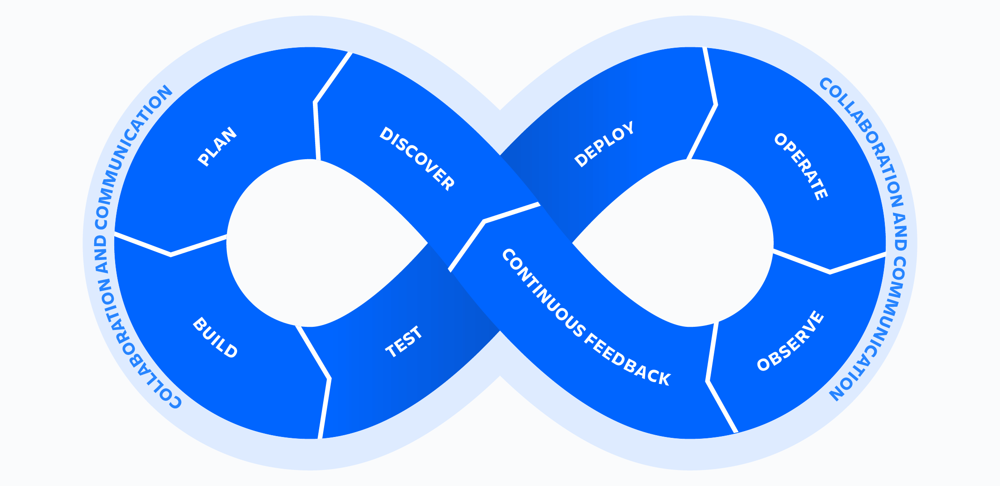

[[toc]]

## 引言

在传统的软件开发模式中，开发团队（Dev）与运维团队（Ops）常常各自为战，这种隔离所导致的慢节奏协作、不明确的角色分工，以及随之而来的瓶颈，严重妨碍了软件快速迭代与高效交付。而 DevOps 的出现，为这一问题提供了解决之道。

DevOps 不仅是一组工具和技术，更是一种贯穿整个开发生命周期的理念和方法论。通过打破部门壁垒、强化协作，DevOps 赋能团队以实现高效开发、自动化运行及快速迭代。在本文中，我们将初步探讨 DevOps 的核心理念、最佳实践、常用工具及其所带来的业务和技术价值，帮助你全面掌握 DevOps 的关键知识点。

## DevOps 核心理念

DevOps 是一种交付文化和框架，其目标是实现软件开发与运维之间的无缝整合。在 DevOps 下，团队致力于 “持续集成（CI）” 和 “持续交付/部署（CD）”，通过流程自动化和实时反馈，显著提升交付效率和产品质量。这一方法论帮助企业在快速变化的市场中保持竞争力和灵活性。

DevOps 思想可以用 “CAMS 原则” 概括：

* 文化（Culture）： 鼓励协作、信任与责任共享。
* 自动化（Automation）： 用工具简化复杂操作，提升效率。
* 衡量（Measurement）： 通过定量指标评估性能，驱动改进。
* 共享（Sharing）： 跨团队知识共享，减少信息孤岛。

通过实施这些原则，DevOps 推动了从开发到运维、甚至用户反馈的全流程协作和提速，彻底改变了传统的工作方式。

## DevOps 方法论

为实现上述目标，DevOps 结合了一系列实践与方法，以下是最常见的三种：

1. Scrum
Scrum 是一种敏捷开发框架，通过短周期迭代（Sprint）逐步交付可用产品。它设有明确的每日站会、Sprint 计划及回顾会议，让团队协作更高效透明。

2. Kanban
Kanban 主张通过可视化工作流（如看板）来跟踪任务和优化资源分配。它尤其适合需要快速交付或频繁调整优先级的团队。

3. Agile
Agile 强调短周期、快节奏的迭代开发，并以客户反馈为核心驱动力。它与 DevOps 的自动化能力完美结合，显著提升了持续交付的效率。

## DevOps 工具链

### 规划工具

在规划阶段，团队需要定义业务价值和需求。常用的工具有 Jira 和 Git，它们帮助团队进行项目管理和问题跟踪。

### 编码工具

编码阶段涉及软件设计和代码编写。常用的工具包括 GitHub、GitLab 和 Bitbucket，这些工具支持代码托管和版本控制。

### 构建工具

构建阶段涉及编译和打包代码。常用的工具有 Docker、Ansible、Puppet、Chef、Maven 和 JFrog Artifactory，它们帮助自动化构建和打包过程。

### 测试工具

持续测试是保证代码质量的关键。常用的测试工具有 JUnit、Selenium、TestNG 和 BlazeMeter，它们支持自动化测试和持续反馈。

### 部署工具

部署阶段涉及将代码发布到生产环境。常用的工具有 Jenkins、Kubernetes、Docker 和 Ansible，这些工具支持自动化部署和环境配置。

### 运维工具

运维阶段涉及生产环境的管理和监控。常用的工具有 Ansible、Puppet、Chef 和 Salt，它们帮助自动化运维任务和环境管理。

### 监控工具

监控阶段涉及生产环境中的应用和基础设施监控。常用的工具有 New Relic、Datadog、Grafana 和 Splunk，它们帮助实时收集和分析监控数据，及时发现和解决问题。

## DevOps 最佳实践

DevOps 实践强调持续改进和自动化，涵盖从开发到运维的各个阶段。以下是一些常见的 DevOps 实践：

### 持续开发

该做法贯穿 DevOps 生命周期的规划和编码阶段。可能涉及版本控制机制。

### 持续测试

该做法包括在编写或更新应用程序代码时进行自动的、预先安排的、持续的代码测试。此类测试可以加快将代码交付到生产环境的速度。

### 持续集成 (CI)

快速检测代码问题并反馈的最佳方式。CI 提倡频繁向代码仓库提交变更，并在每次提交后自动执行一系列构建、测试任务，确保代码质量始终在线。

### 持续交付/持续部署 (CD)

在实现 CI 的基础上，CD 进一步自动部署经过验证的代码变更到测试环境或生产环境。持续交付保证了 “代码可用性”，持续部署则实现了完全的发布自动化，真正做到 “随时上线”。

### 基础设施即代码 (IaC)

该做法可用于 DevOps 的各个阶段，以自动配置软件发布所需的基础设施。开发人员可从现有开发工具中添加基础架构“代码”。例如，开发人员可以按需从 Docker、Kubernetes 或 OpenShift 创建存储卷。该做法还可以使运维团队能够监控环境配置、跟踪更改并简化配置回滚。

### 持续监控

持续监控通过实时收集和分析监控数据，以了解应用程序和基础设施性能如何影响其产品的最终用户体验。通过对应用程序和基础设施生成的数据进行采集、分类和分析，开发人员可以了解变更或更新如何影响用户，同时深入了解出现问题或意外变故的根本原因。由于服务必须全天候持续可用，而且应用程序和基础设施的更新频率不断提高，因此主动监控变得日益重要。此外，创建警报或对这些数据执行实时分析也能帮助组织更主动地监控其服务。

### 微服务架构

微服务架构是一种将单个应用程序构建为一系列小服务的设计方法。其中每个服务均按各自的流程运行，并利用一种轻型机制（通常为基于 HTTP 的应用程序编程接口 (API)）通过一个明确定义的接口与其他服务进行通信。微服务围绕着业务能力进行构建，每项服务均限定到单个目的。您可以使用不同的框架或编程语言来编写微服务，并将其作为单个服务或一组服务进行独立部署。

## 总结

DevOps 并非只是一组工具配置或方法论，而是一场从文化思想到实践流程的全方位转型。通过整合开发与运维，企业不仅加快了系统迭代速度，还在确保质量的同时显著提升了组织敏捷性。实施 DevOps 的道路可能充满挑战，但其为企业所释放的潜能无疑令人振奋。

## 参考文献

[https://www.reddit.com/r/devops/comments/812527/can_someone_explain_what_devops_is/](https://www.reddit.com/r/devops/comments/812527/can_someone_explain_what_devops_is/)
[https://aws.amazon.com/cn/devops/what-is-devops/](https://aws.amazon.com/cn/devops/what-is-devops/)
[https://www.atlassian.com/devops](https://www.atlassian.com/devops)
