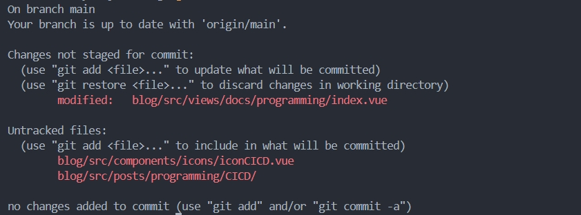

[[toc]]

## 引言

在现代软件开发中，版本控制系统已经成为必不可少的工具。Git 作为最流行的分布式版本控制系统之一，提供了强大的功能，特别是在多人协作的开发环境中。通过 Git，开发者不仅可以跟踪代码的每一次变更，还可以高效地管理不同功能的开发、处理并发修改、以及解决代码冲突等。

本篇文章将详细介绍 Git 的常用操作和一些常见的使用场景，帮助你从基础操作到分支管理，全面掌握 Git 的使用。对刚接触 Git 的人，可以快速入门，对 Git 的基本操作和分支管理有一个基本的了解。

## 1. 简介 Git 和常用命令

Git 是一种强大的分布式版本控制系统，广泛应用于软件开发中，尤其是当项目需要多人协作时。Git 不仅可以跟踪文件的历史版本，还能有效管理分支和合并操作，是现代开发流程的核心工具之一。

Git 的基本思想是：每个开发者的工作站上都拥有完整的项目副本和所有版本的历史记录。与传统的集中式版本控制系统不同，Git 不依赖中央服务器存储代码，它通过分布式结构保证了代码管理的高效性和可靠性。

### 常用 Git 命令

1. `git init`：初始化一个新的 Git 仓库
2. `git clone <repository_url>`：克隆一个远程仓库到本地
3. `git status`：查看工作目录与暂存区的状态
4. `git add <file>`：将文件添加到暂存区
5. `git commit -m "message"`：将暂存区的修改提交到本地仓库
6. `git push`：将本地的提交推送到远程仓库
7. `git pull`：从远程仓库拉取并合并最新的代码
8. `git log`：查看提交历史

---

## 2. 基本操作

Git 的基本操作涉及对文件的跟踪、提交和推送等。接下来，我们将详细介绍这些常见操作。

### 2.1 代码提交到暂存区

当我们在工作目录中修改了文件时，Git 并不会自动将这些修改加入版本控制。首先，我们需要将更改加入暂存区。暂存区的作用是暂时存储准备提交到本地仓库的修改。

例如，我们修改了一个文件 `index.js`，想要提交这个更改：

```bash
git add index.js
// 如果修改了多个文件，想要一次性将所加入暂存区的修改提交到本地仓库，可以使用以下命令
git add .

```

在暂存区中，我们可以使用 `git status` 命令来查看当前状态：


在上述命令的输出中，我们可以看到已经更改的但未提交到暂存区的文件和未追踪的文件。

### 2.2 暂存区代码提交到本地仓库

一旦我们将文件添加到暂存区，就可以将其提交到本地仓库。提交的过程实际上是创建一个新的版本，将当前更改保存下来。

```bash
git commit -m "Fix bug in index.js"
```

在 -m 后面的字符串是提交信息，应该简洁且具有描述性，解释这次提交的目的。
提交规范大致有这些：

* feat - 新功能 feature
* fix - 修复 bug
* docs - 文档注释
* style - 代码格式(不影响代码运行的变动)
* refactor - 重构、优化(既不增加新功能，也不是修复bug)
* perf - 性能优化
* test - 增加测试
* chore - 构建过程或辅助工具的变动
* revert - 回退
* build - 打包

### 2.3 推送到远程仓库

在将更改提交到本地仓库后，如果我们希望将这些更改与他人共享，就需要将其推送到远程仓库。例如我们已经连接到一个远程仓库，并且在本地分支上做了一些更改，使用以下命令将更改推送到远程仓库的相应分支：

```bash
git push origin main
```

### 2.4 撤销提交

在开发过程中，我们难免会犯错，不小心提交了错误代码。遇到这种情况，不要慌，Git 提供了多种方法来帮助我们解决问题。根据错误代码是否已经推送到远程仓库，我们可以采取不同的策略。

#### 本地撤销

如果只是在本地提交了错误代码，还没有推送到远程仓库，那么处理起来相对简单。你可以选择以下两种方法之一来修正错误。首先，` git reset `是一个非常强大的命令，可以帮助你撤销最近的提交。

1. 软重置（Soft Reset）：如果你只是想撤销提交，但保留文件的变更内容，可以使用软重置。这样，你可以重新编辑代码后再提交。
2. 混合重置（Mixed Reset，默认选项）：如果你想撤销提交，并将变更从暂存区移回工作目录，可以使用混合重置。
3. 硬重置（Hard Reset）：如果你确定要丢弃所有变更，可以使用硬重置。但请注意，这个操作是不可逆的，一旦执行，所有未提交的变更都将丢失。

```bash
// 以下命令分别对应1，2，3
git reset --soft HEAD~1
git reset HEAD~1
git reset --hard HEAD~1
```

还有一种就是使用` git commit --amend ` 修改提交，这个命令会打开一个文本编辑器，让你修改提交信息。如果你只是想修改提交内容，可以直接保存退出编辑器，Git 会提示你是否要修改提交内容。这种方法非常适合在本地修正错误提交，而不需要创建新的提交记录。

#### 远程撤销

如果错误代码已经推送到远程仓库，情况会稍微复杂一些，因为你需要考虑远程仓库的状态和其他可能的协作开发者。

使用` git revert `创建反向提交，这是一种安全的方法，用于在远程仓库中撤销错误提交。它会创建一个新的提交，这个提交是错误提交的反向操作，从而有效地撤销错误提交的影响。

```bash
git revert COMMIT_HASH
```

使用` git log `或者` git reflog `命令，找到对应的提交哈希值，将 COMMIT_HASH 替换为错误提交的哈希值。这个命令会创建一个新的提交，撤销错误提交的变更。这种方法不会修改历史记录，因此不会影响其他开发者的本地仓库。

或者使用另外一种方法间接达到目的，就是先` git reset `修正错误提交，再push到远程仓库。

### 2.5 更新代码

这个的话很简单了，就是从远程仓库拉取最新的代码让我们保持本地代码的同步。使用 git pull 命令可以将远程仓库的更新合并到本地：

```bash
git pull
```

### 2.6 暂存修改

有时候我们正在处理某些功能的开发，但必须切换到其他分支去处理一些bug或者紧急任务。此时，可以将当前修改暂存起来，稍后再恢复。

```bash
//存储
git stash
//恢复
git stash pop
```

## 3. 分支操作

分支管理功能是 Git 的强大功能之一。分支允许开发人员在不同的独立环境中并行工作，避免了不同功能之间的干扰。当某个功能开发完成并经过测试后，开发人员可以将其合并回主分支。通过这种方式，Git 有效地支持了多人协作开发，并且使得代码版本的管理变得更加清晰和灵活。

### 3.1 选择分支

在 Git 中，使用分支可以帮助我们同时进行多个开发任务。要查看当前 Git 仓库中的所有分支，可以使用 git branch 命令。执行该命令后，Git 会列出所有分支，并且在当前分支前加上星号（*）标记。这样你就可以一目了然地知道自己当前所在的分支。

例如，假设我们在一个项目中有两个分支，main 和 develop，执行以下命令：

```bash
git branch
// 输出如下，则表示我们当前在main分支
develop
* main
```

### 3.2 新建分支

新建分支是 Git 中一种常见的操作，特别是当你需要开发新的功能或修复 bug 时，建议先创建一个新的分支，这样可以避免直接在主分支上进行修改。通过在独立的分支上工作，你可以将主分支保持为稳定的状态，直到新功能开发完成并经过测试。

```bash
git checkout -b feature/new-feature
```

这行命令做了两件事：首先，它创建了一个名为 feature/new-feature 的新分支；其次，它自动将你切换到这个新创建的分支。创建新分支后，你可以在此分支上自由地进行开发和提交，直到该功能开发完成。

值得注意的是，在新分支上工作时，你会看到该分支与其他分支（例如 main）相互独立，这意味着你在 feature/new-feature 分支上的所有修改都不会影响 main 分支，直到你明确地将更改合并回主分支。

### 3.3 比较分支

在多分支开发中，比较不同分支的差异是非常常见的操作。当你想了解两个分支的具体差异时，可以使用 git diff 命令。此命令会显示两个分支间的所有不同之处，包括代码行的增加、删除或修改。

```bash
git diff main feature/new-feature
```

这个命令会显示自从 main 分支创建以来，feature/new-feature 分支上的所有改动。它不仅会显示代码的具体变动，还会指明这些变动是在哪些文件和行号上发生的。这对于代码审查、功能开发以及 bug 修复时的差异定位非常有用。

### 3.4 合并分支

当开发人员在某个分支上完成了新功能的开发并且经过了测试，下一步通常就是将该分支合并回主分支（如 main）。合并分支的目的是将独立分支上的更改同步到主分支，从而确保主分支包含所有最新的功能。那么我们应该将分支切到主分支然后` merge `需要合并的代码分支。

```bash
git merge develop
```

如果 Git 能够自动地将两个分支的更改合并在一起，那么合并操作就会顺利完成。此时，Git 会生成一个新的提交，将合并后的代码保存到当前分支（即 main）中。

然而，如果两个分支都对同一行代码做了不同的修改，就会出现冲突。在这种情况下，Git 会标记出冲突的文件并提示开发者手动解决这些冲突。这时候，我们需要打开冲突文件，手动决定保留哪个版本的代码，或者合并两个版本的代码。然后删除冲突标记（<<<<<<<, =======, >>>>>>>），并保存文件，将解决冲突的文件添加到暂存区进行提交合并。

### 3.5 删除分支

在 Git 中，分支创建之后，如果该分支的功能已经合并到主分支，或者该分支已经不再需要，就可以删除这个分支。删除分支有助于保持仓库的整洁，避免冗余的分支堆积。

要删除本地分支，首先确保你当前不在该分支上。比如我们已经将 feature/new-feature 分支合并到 main，现在可以删除 feature/new-feature 分支：

```bash
git branch -d feature/new-feature
```

这个时候，如果我们试图删除的分支尚未完全合并，Git 会阻止删除操作以避免数据丢失。若确定该分支已经不再需要，或者不在乎丢失该分支上的更改，可以使用强制删除：

```bash
git branch -D feature/new-feature
```

上述会将本地分支删除，进一步将远程分支删除的话，执行下面命令即可。

```bash
git push origin --delete feature/new-feature
```

## 总结

Git 是现代软件开发中不可或缺的工具，它不仅能帮助你管理版本，还能有效应对团队协作中的各种挑战。通过本文介绍的基本操作和分支管理，你可以更好地控制代码的版本，处理并行开发和代码合并的复杂问题，提升开发效率。

掌握 Git 的基本技能，能够帮助你在项目中轻松管理分支、解决冲突，并保持团队的代码一致性。希望通过本文的内容，你能更好地理解并应用 Git，提高开发流程的效率和质量。

## 参考文献

[https://git-scm.com/doc](https://git-scm.com/doc)
[https://juejin.cn/post/6844903793033756680](https://juejin.cn/post/6844903793033756680)
