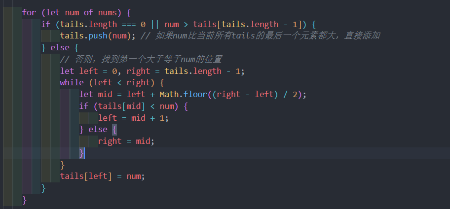

[[toc]]

## 引言

Vue 3 的发布不仅带来了性能上的显著提升，还引入了许多优化技术，其中最值得一提的就是其 diff 算法的革新。Vue 3 的 diff 算法在处理组件更新时引入了最长递增子序列（LIS）的概念，用以优化列表渲染的效率。这引发了我的兴趣，因为 LIS 问题本身就是算法领域的一个经典问题，具有广泛的应用场景。从 Vue 3 的 diff 算法出发，我们可以探讨如何高效地解决最长递增子序列问题。本文将介绍两种解决 LIS 问题的策略：一种基于动态规划的传统方法，另一种是结合贪心和二分查找的创新方法。

话不多说，直接开整，对应力扣第300题。

### 动态规划解法

动态规划的思想主要就三个关键方面：

* 问题分解：动态规划将大问题分解为更小的子问题
* 状态定义：这种状态定义帮助我们将问题简化为单一维度上的思考：每个位置 i的最优解
* 状态转移方程：这是动态规划的核心规则，它描述了如何从已知状态推导出未知状态。

如果还要考虑到性能问题，则还需考虑存储和复用方面。

在解决最长递增子序列（LIS）问题时，这些关键方面可以如下所示：

* 问题分解：对于每一个元素，我们只需要找到一个比它小的数，然后加上这个数，这样我们就能得到一个递增的子序列。也就是说到目前这个数为止的递增子序列的长度。
* 状态定义：动态规划通常需要一个数组dp来记录状态，这里我们记录每个元素到目前这个数为止的递增子序列的长度。即` dp[i] `代表对应位置的最长递增子序列的长度
* 状态转移方程：我们只需要和前面的数依次比较，如果前面的数小于当前数，那么当前数可以加入到递增子序列中，此时`dp[i]`的值就是`dp[j] + 1`，如果前面的数大于当前数，那么当前数不能加入到递增子序列中，此时`dp[i]`的值就是`dp[j]`，即最后的方程就是`dp[i] = max(dp[i], dp[j]+1)`。


图片有点抽象，不过没关系，我们思路的已经很清晰了，代码如下：

```javascript
function lengthOfLIS(nums) {
    if (nums.length === 0) return 0;

    let dp = new Array(nums.length).fill(1); // 初始化dp数组

    for (let i = 1; i < nums.length; i++) {
        for (let j = 0; j < i; j++) {
            // 如果当前数字大于之前的数字，可以接在之前的序列后面，更新长度
            if (nums[i] > nums[j]) {
                dp[i] = Math.max(dp[i], dp[j] + 1);
            }
        }
    }

    // 返回dp中最大的值，即最长递增子序列的长度
    return Math.max(...dp);
}
```

### 贪心算法结合二分查找方法

贪心算法结合二分查找方法解决最长递增子序列（LIS）问题，通常被称为"耐心排序"或"Patience Sorting"。这种方法的核心思想是：

* 贪心选择：我们维护一个"堆"，每个堆的顶部是当前最小的未被覆盖的数字。对于每个新数字，我们要么创建一个新堆（如果这个数字比所有堆顶都大），要么将它放入到合适的堆中，使得堆的顶部元素最小，这个呢是通过每次局部最优选择逐步构建最终解。
* 二分查找：当我们需要为一个新数字找到合适的堆时，使用二分查找可以高效地在这些堆中找到第一个大于等于这个数字的位置，从而优化选择过程。

关键方面如下：

* 问题分解：在这个方法中，我们用一个数组 tails 来模拟多个堆，每个堆代表一个可能的最长递增子序列的结尾。其中 tails[i] 表示长度为 i+1 的最长递增子序列的最后一个元素。
* 局部选择最优：
  对于每一个新数字，我们进行以下操作：
  * 如果这个数字大于 tails 中所有元素的最后一个，那么它可以直接添加到 tails 的末尾，意味着我们找到了一个更长的递增子序列。
  * 否则，我们需要在这个数字在 tails 中找一个合适的位置。目标是找到第一个大于或等于该数字的位置，因为这样我们可以用这个新数字替换那个位置的旧数字，从而保持序列的递增性，同时不增加序列的长度。

* 性能优化：通过使用二分查找，复杂度从 O(n^2) 降至 O(n log n)。




其实就是每次将小的数插入的合适的位置，大的直接push进去就好。最终实现代码如下：

```javascript
function lengthOfLIS(nums) {
    if (nums.length === 0) return 0;

    let tails = []; // tails[i] 表示长度为 i+1 的递增子序列的最后一个数字

    for (let num of nums) {
        if (tails.length === 0 || num > tails[tails.length - 1]) {
            tails.push(num); // 如果num比当前所有tails的最后一个元素都大，直接添加
        } else {
            // 否则，找到第一个大于等于num的位置
            let left = 0, right = tails.length - 1;
            while (left < right) {
                let mid = left + Math.floor((right - left) / 2);
                if (tails[mid] < num) {
                    left = mid + 1;
                } else {
                    right = mid;
                }
            }
            tails[left] = num; 
        }
    }

    return tails.length;
}
```
