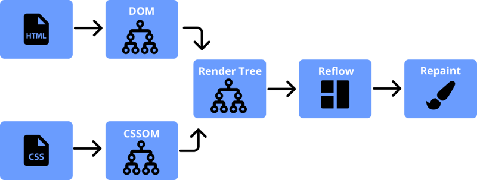

[[toc]]

## 引言

Reflow 和 Repaint 是浏览器渲染过程中的两个重要概念。重排是浏览器重新计算页面上元素的布局和位置的过程。Repaint 是浏览器在页面上重新绘制元素的过程。在本文中，我们将讨论浏览器渲染过程、Reflow 和 Repaint，以及如何优化。

## 浏览器渲染过程

---

在了解reflow和repaint之前，我们先了解浏览器渲染过程。在浏览器中，页面的渲染过程大致分为以下几步:

（[详细的可以看我的另一篇文章浏览器的渲染原理](https://www.backlighting.cn/docs/programming/browser/%E6%B5%8F%E8%A7%88%E5%99%A8%E7%9A%84%E6%B8%B2%E6%9F%93%E5%8E%9F%E7%90%86)）：



* 当用户输入 URL 时，它将从服务器获取 HTML 源代码
* 根据此生成DOM树和CSSOM树，然后合并为RenderTree(渲染树)
* 渲染树具有 DOM 的结构和每个节点的样式，但这还不足以显示页面。浏览器还需要计算屏幕上每个节点的大小和位置。此过程称为 布局，并生成布局树。
* 拥有 DOM、style 和 layout 仍然不足以显示页面，浏览器仍然需要确定元素绘制的顺序。因此，接下来浏览器会进行分层以及主线程会为每个层单独产生绘制指令集。
* 接下来由合成线程进行分块，交由GPU线程进行光栅化，生成每一块的位图。
* 最后由合成线程拿到每个层、每个块的位图后生成一个个「指引（quad）」信息，指引会标识出每个位图应该画到屏幕的哪个位置，以及会考虑到旋转、缩放等变形。这就是最后一步画。

## Reflow和Repaint

---

Reflow 和 Repaint 是指渲染过程的布局和绘制步骤。当我们做一些事情来改变布局或样式时，Reflow 或 Repaint 将被触发。

### Reflow

Reflow 是影响浏览器性能的一个非常重要的因素，因为它可能会导致整个或部分页面布局被更新，并且可能会因为节点大小的变化而触发整个页面 Reflow。Reflow 意味着重新计算文档中元素的位置和几何图形。当对元素进行更改时，将发生重排，这些更改会影响部分或整个页面的布局。元素的 Reflow 将导致 DOM 中所有子元素和祖先元素的后续重排例如：更改 width、height、font-size 等。

### Repaint

当页面上的元素需要更改颜色或其他不影响布局的属性时，浏览器将执行 Repaint。与 Reflow 不同，Repaint 不会影响页面的布局，但也会影响页面的性能。例如：更改轮廓、可见性、颜色、背景色等。

### 触发 Reflow 和 Repaint

* 在添加、删除、更新 DOM 节点时将发生重排
* 调整窗口大小将触发重排
* 更改 font-style 会改变元素的几何图形。这意味着它可能会影响页面上其他元素的位置或大小，这两者都需要浏览器执行重排。完成这些布局操作后，任何损坏的像素都需要重新绘制。
* 操作 DOM 的脚本是昂贵的操作，因为每次修改文档或文档的一部分时，它们都会重新计算。除此以外，读取dom的一些例如`height`,`offsetWidth`,这会导致浏览器强制`reflow`以确保读取的值是最新的。
* 使用 display： none 隐藏 DOM 元素将导致重排和重绘。
* 使用 visibility： hidden 隐藏 DOM 元素将导致唯一的重绘，因为没有布局或位置更改，同样的opacity 值也会导致重绘而不会重排。

### 如何尽量避免Reflow和Repaint？

* 不要逐个更改单个样式。为了保持健全性和可维护性，最好的办法是更改类名，而不是样式。

```js
// bad
var left = 10,
    top = 10;
el.style.left = left + "px";
el.style.top  = top  + "px";

// better 
el.className += " theclassname";

// or when top and left are calculated dynamically...

// better
el.style.cssText += "; left: " + left + "px; top: " + top + "px;";

```

* 批量更改dom，比如放到fragement，再append到dom中。
* 不要重复请求计算样式，将它们缓存到变量.

### 为什么transform效率高？

transform 是一个非常特殊的属性，它不会触发 reflow，只会触发 repaint。这是因为 transform 属性会改变元素的几何图形，从而导致元素只在浏览器的渲染过程的最后一步画的地方开始改变，前边的布局不会发生影响，不会触发reflow，因此这也是transform性能更好的原因。opacity也同理。

## 参考文献

[https://www.explainthis.io/en/swe/repaint-and-reflow](https://www.explainthis.io/en/swe/repaint-and-reflow)
[https://dev.to/gopal1996/understanding-reflow-and-repaint-in-the-browser-1jbg](https://dev.to/gopal1996/understanding-reflow-and-repaint-in-the-browser-1jbg)
[https://developer.mozilla.org/zh-CN/docs/Glossary/Reflow](https://developer.mozilla.org/zh-CN/docs/Glossary/Reflow)
