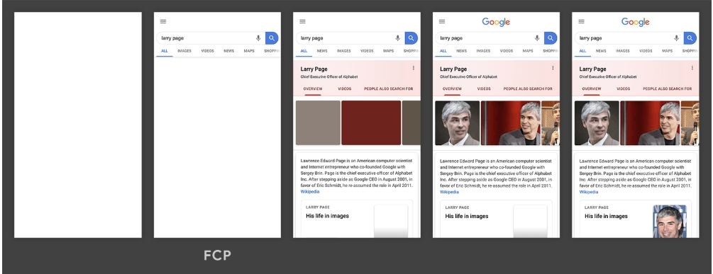
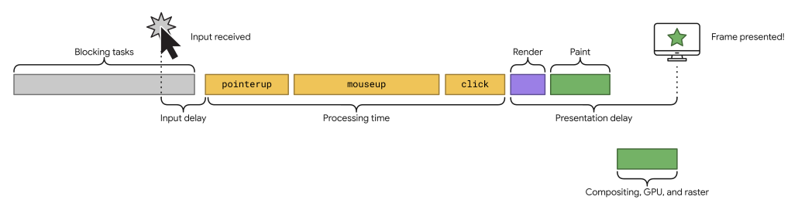

[[toc]]

## 引言

性能对于任何在线业务的成功都至关重要。与加载速度缓慢、让人感觉运行缓慢的网站相比，加载速度快并能及时响应用户输入的网站能更好地吸引并留住用户。
但是，当我们谈到性能和提高网站“速度”时，具体是指什么呢？

事实上，效果是相对的：

* 对一位用户而言，网站速度可能较快（使用功能强大的设备时网络速度较快），但对另一用户而言速度较慢（使用低端设备的网络较慢）。
* 两个网站可能在完全相同的时间内完成加载，但加载速度可能更快（如果该网站加载内容的速度会变快，而不是等到最后才显示任何内容）。
* 网站可能看起来加载很快，但对用户互动的响应速度很慢（或根本不响应）。

## 指标相关

---

### 如何衡量指标

效果指标一般通过以下两种方式之一进行衡量：

*实验室中*：使用工具在一致且受控的环境中模拟网页加载
*实际用户*：关于真实用户实际加载网页并与之互动
这两种方式并无优劣之分。实际上，我们通常希望同时使用这两种方式来确保获得良好的效果。

#### 实验室

在实验室中测试性能对于开发新功能至关重要。在功能发布到生产环境之前，无法针对真实用户衡量其性能特征，因此在发布功能之前在实验室中进行测试是防止性能下降的最佳方法。

#### 实际用户

另一方面，虽然在实验室中进行测试是性能的合理代表性指标，但并不一定能反映出实际用户在您网站上的体验。

网站的性能可能会因用户的设备功能及其网络状况而产生巨大差异。还会根据用户是否（或如何）与网页进行互动而有所不同。

网页加载也并非总是确定性的。例如，加载个性化内容或广告的网站可能会因用户而异。实验室测试无法捕获这些差异。

要想真正了解网站对用户的效果，唯一的方法就是实际衡量网站在用户加载和互动时的性能。这种类型的衡量通常称为“真实用户监控”(RUM)。

### 指标类型

还有一些其他类型的指标与用户对效果的感受相关。

* 感知的加载速度：网页能够以多快的速度加载网页中的所有视觉元素并将其呈现在屏幕上。
* 加载响应速度：网页为了能够快速响应用户互动而加载和执行任何必需的 JavaScript 代码的速度
* 运行时响应速度：网页加载后，网页对用户互动的响应速度如何。
* 视觉稳定性：网页上的元素是否以用户意想不到的方式偏移，并且可能会干扰用户的互动？
* 流畅性：过渡和动画是否以一致的帧速率渲染，并在一种状态之间流畅地流动

### 要衡量的重要指标

* *首次内容绘制 (FCP)*：衡量从网页开始加载到网页内容的任何部分在屏幕上呈现的时间。（实验，字段）
* *Largest Contentful Paint (LCP)*：衡量从网页开始加载到屏幕上呈现最大的文本块或图片元素所用的时间。（实验，字段）
* *Interaction to Next Paint (INP)*：衡量与网页进行的每个点按、点击或键盘互动的延迟时间，并根据互动次数选择网页最差（或接近最长的互动延迟时间）作为单个代表性值，以描述网页的整体响应能力。（实验，字段）
* *总阻塞时间 (TBT)*：衡量 FCP 和 TTI 之间的总时长，在该时间段内，主线程处于阻塞状态的时长足以阻止输入响应。（实验）
* *Cumulative Layout Shift (CLS)*：衡量从网页开始加载到其生命周期状态变为隐藏期间发生的所有意外布局偏移的累计得分。（实验，字段）
* *首字节时间 (TTFB)*：衡量网络使用资源的第一个字节响应用户请求所需的时间。（实验，字段）

接下来我们将详细介绍这些指标。

## First&nbsp;Contentful&nbsp;Paint (FCP)

---

### FCP 是什么？

---

首次内容渲染 (FCP) 用于衡量从用户首次导航到网页到网页任何一部分内容呈现在屏幕上的时间。对于此指标，“内容”是指文本、图片（包括背景图片）、`<svg>` 元素或非白色 `<canvas>` 元素。

### FCP 得分多少算好？

为了提供良好的用户体验，网站应尽量将首次有意义的绘制时间控制在 1.8 秒或更短的时间。为确保大多数用户都能达到此目标值，一个合适的衡量阈值是网页加载时间的第 75 个百分位数，并按移动设备和桌面设备进行细分。良好的 FCP 值不超过 1.8 秒。差的值大于 3.0 秒.

### 如何提高FCP？

* 移除阻塞渲染的资源
* 缩减 CSS 大小
* 移除未使用的 CSS
* 移除未使用的 JavaScript
* 预先连接到必需的源
* 缩短服务器响应时间 (TTFB)
* 避免多次网页重定向
* 预加载密钥请求
* 避免网络载荷过大
* 采用高效的缓存策略提供静态资源
* 避免 DOM 规模过大
* 最大限度地缩短关键请求深度
* 确保文本在网页字体加载期间保持可见状态
* 请保持较低的请求数量和较小的传输大小

## Largest&nbsp;Contentful&nbsp;Paint (LCP)

---

过去，衡量网页主要内容加载和对用户可见的速度一直是网络开发者面临的一项挑战。load 或 DOMContentLoaded 等旧版指标效果不佳，因为它们不一定与用户在屏幕上看到的内容相对应。而首次内容渲染 (FCP) 等以用户为中心的新型性能指标仅捕获加载体验的开头部分。如果网页显示启动画面或加载指示器，这一时刻与用户不太相关。

后来根据 W3C 网站性能工作组的讨论和 Google 开展的研究发现，衡量网页主要内容的加载时间时，更准确的方法是查看渲染最大的元素的时间。

### 什么是 LCP？

LCP 会报告视口中可见的最大图片、文本块或视频的渲染时间（相对于用户首次导航到网页的时间）。

### LCP 得分多少算好？

为了提供良好的用户体验，网站应尽力使 Largest Contentful Paint 不超过 2.5 秒。为确保大多数用户都能达到此目标值，一个合适的衡量阈值是网页加载时间的第 75 个百分位数，并按移动设备和桌面设备进行细分。良好的 LCP 值应不超过 2.5 秒，差的大于4.0s。。

### 哪些元素会影响？

如 Largest Contentful Paint API 中当前所指定，考虑最大内容渲染时间的元素类型包括：

* `` 元素（第一帧呈现时间适用于 GIF 或动画 PNG 等动画内容）
* `<svg>` 元素中的 `<image>` 元素
* `<video>`元素（使用海报图片加载时间或视频的第一帧呈现时间，以时间较短者为准）
* 使用 url() 函数加载背景图片的元素（而不是 CSS 渐变）
* 包含文本节点或其他内嵌级文本元素子元素的块级元素。

## Cumulative&nbsp;Layout&nbsp;Shift (CLS)

---

意外的布局偏移可能会以多种方式干扰用户体验，例如，如果文本突然移动，会导致用户在阅读时迷失位置，或者导致用户点击错误的链接或按钮。在某些情况下，这可能会造成严重损害。

当资源异步加载或 DOM 元素在现有内容之前动态添加到网页时，网页内容通常会意外移动。布局偏移的原因可能是尺寸未知的图片或视频、比初始后备字体大或小的呈现字体，或者会自行调整大小的第三方广告或 widget。

网站在开发中的运行方式与其用户体验之间的差异会让问题更严重。例如：

* 个性化内容或第三方内容在开发环境和生产环境中的行为通常有所不同。
* 测试图片通常已位于开发者的浏览器缓存中，但对于最终用户，加载时间会更长。
* 在本地运行的 API 调用通常非常快，因此在开发环境中不易察觉的延迟在生产环境中可能会变得非常明显。

累计布局偏移 (CLS) 指标可衡量真实用户发生此问题的频率。

### CLS 是什么？

CLS 用于衡量在网页的整个生命周期内发生的每一次意外布局偏移的布局偏移得分的最高累计分数。

每当可见元素从一个呈现帧更改到下一个呈现帧时，都会发生布局偏移。

大量布局偏移（称为会话窗口）是指一个或多个单独的布局偏移快速连续发生，每次偏移之间间隔不到 1 秒，并且总窗口时长不超过 5 秒。

最严重的突发是指会话时段内所有布局偏移的累计分数最高的时段。

### CLS 得分多少算好？

为了提供良好的用户体验，网站应尽力使 CLS 得分不高于 0.1。为确保大多数用户都能达到此目标值，一个合适的衡量阈值是网页加载时间的第 75 个百分位数，并按移动设备和桌面设备进行细分。合适的 CLS 值为 0.1 或更低。差的值大于 0.25。

## Interaction&nbsp;to&nbsp;N1ext&nbsp;Paint (INP)

---

Chrome 使用情况数据显示，用户 90% 的页面停留时间都是在加载后所花，因此，在整个网页生命周期中仔细衡量响应速度非常重要。INP 指标就是用来评估这一点的。

良好的响应能力意味着网页对互动做出快速响应。当网页响应互动时，浏览器会在其绘制的下一帧中提供视觉反馈。例如，视觉反馈会告诉你  是否确实添加了您添加到在线购物车中的商品、移动导航菜单是否打开、服务器是否正在对登录表单的内容进行身份验证等。

有些互动的用时自然要比其他互动长，但对于特别复杂的互动，必须快速显示一些初始视觉反馈，让用户知道正在发生某件事。浏览器要绘制的下一帧是最早执行此操作的机会。

因此，INP 的目的不是衡量互动的最终影响（例如网络提取和其他异步操作的界面更新），而是衡量下一次绘制被阻塞的时间。

### 什么是 INP？

INP 是一项指标，通过观察用户访问网页期间发生的所有点击、点按和键盘互动的延迟时间，评估网页对用户互动的总体响应情况。最终 INP 值是观测到的最长互动时间，离群值会被忽略。

互动是指在同一逻辑用户手势期间触发的一组事件处理脚本。例如，触摸屏设备上的“点按”互动包括多个事件，例如 pointerup、pointerdown 和 click。互动可以由 JavaScript、CSS、内置浏览器控件（例如表单元素）或它们的组合驱动。

互动延迟时间包括一组触发互动的事件处理脚本的单个最长时长，从用户开始互动到浏览器下次能够绘制帧的时刻。

### INP 得分怎样才算理想？

很难对响应速度指标固定“良好”或“不佳”等标签。一方面，你要在开发实践中优先采用良好的响应能力。另一方面，还需要考虑到，用户在设置可实现的开发预期时所用设备的功能存在很大差异。

为确保您提供响应迅速的用户体验，一个合适的衡量阈值是现场记录的网页加载时间的第 75 个百分位数，按移动设备和桌面设备进行细分：

INP 低于或等于 200 毫秒表示网页响应速度良好。
如果 INP 高于 200 毫秒或低于 500 毫秒，则表示网页的响应速度需要改进。
INP 超过 500 毫秒表示网页响应缓慢。

良好的 INP 值应不超过 200 毫秒。不良值超过 500 毫秒。

### 互动中包含哪些内容？

互动性的主要驱动因素通常是 JavaScript，但浏览器确实可以通过不依赖 JavaScript 的控件（例如复选框、单选按钮和 CSS 控件）提供互动性。

就 INP 而言，系统仅观察到以下互动类型：

使用鼠标点击。
在带触摸屏的设备上点按。
按实体键盘或屏幕键盘上的按键。

用户还可以通过其他方式（例如悬停、缩放或滚动）与网页互动。这些互动并非出于 INP 目的而被观察到。不过，这些互动的一些变体可能包括 INP 会衡量的点击、点按或按键操作等手势。

互动发生在主文档或文档中嵌入的 iframe 中，例如在嵌入式视频中点击播放。最终用户不会知道 iframe 中是否包含内容，因此需要在 iframe 中植入 INP，以便衡量顶级页面的用户体验。由于 JavaScript Web API 无法访问 iframe 的内容，因此这可能会导致 CrUX 和 RUM 之间出现差异

互动可以由多个事件组成。例如，按键操作包括 keydown、keypress 和 keyup 事件。点按互动包含 pointerup 和 pointerdown 事件。互动中时长最长的事件会增加互动总延迟时间。

互动可以由多个事件组成。例如，按键操作包括 keydown、keypress 和 keyup 事件。点按互动包含 pointerup 和 pointerdown 事件。互动中时长最长的事件会增加互动总延迟时间。

系统会在用户离开页面时计算页面的 INP。结果是一个值，代表网页在其生命周期内的总体响应能力。INP 较低表示网页可靠地响应用户输入。

### First&nbsp;Input&nbsp;Delay (FID)

FID 用于衡量从用户首次与网页互动（即点击链接、点按按钮或使用由 JavaScript 提供支持的自定义控件）到浏览器实际能够开始处理事件处理脚本以响应该互动的时间。并且，即使未注册事件监听器，系统也会衡量 FID。原因在于，许多用户互动不需要事件监听器，但需要主线程处于空闲状态才能运行。

FID 是一项指标，用于衡量网页在加载期间的响应能力。因此，它仅关注点击、点按和按键等离散操作的输入事件。

滚动和缩放等其他互动是连续操作，具有完全不同的性能限制（此外，浏览器通常能够通过在单独的线程中运行这些操作来隐藏其延迟时间）。

换句话说，FID 侧重于 RAIL 性能模型中的 R（响应能力），而滚动和缩放与 A（动画）更相关，因此应单独评估它们的性能质量。也因此，目前已经使用INP替代了FID。

### FID与INP有什么区别？

NP 是 First Input Delay (FID) 的后继指标。虽然这两者都是响应速度指标，但 FID 仅衡量网页上首次互动的输入延迟。INP 通过观察网页上的所有互动（从输入延迟开始，到运行事件处理脚本所需的时间，最后到浏览器绘制下一个帧为止）来改进 FID。

这些差异意味着，INP 和 FID 是不同类型的响应性指标。如果 FID 是旨在评估网页给用户的第一印象的加载响应性指标，则 INP 是更可靠的整体响应指标，而不考虑网页互动发生在网页的生命周期中。

## Total&nbsp;Blocking&nbsp;Time (TBT)

---

### 什么是 TBT？

总阻塞时间 (TBT) 指标用于衡量在 First Contentful Paint (FCP) 之后主线程被阻塞的时间足以阻止输入响应的总时间。

每当存在长任务（即在主线程上运行超过 50 毫秒的任务）时，主线程都会被视为“阻塞”。我们之所以说主线程处于“阻塞”状态，是因为浏览器无法中断正在执行的任务。因此，如果用户在长时间运行的任务过程中与网页互动，浏览器必须等待任务完成后才能响应。

如果任务时间足够长（超过 50 毫秒），用户很可能会注意到延迟，并认为网页运行缓慢或已损坏。

给定长任务的阻塞时间是指其超过 50 毫秒的时长。网页的总阻塞时间是在测量的时间范围内（通常是针对网页加载工具的 TTI，或其他工具的总跟踪时间）在 FCP 后发生的每项长任务的阻塞时间的总和。

下图，其中显示了网页加载期间浏览器的主线程：

主线程上任务的时间轴。

上图中的时间轴包含五个任务，其中三个是长时间运行的任务，因为它们的时长超过 50 毫秒。下图显示了每个耗时较长的任务的阻塞时间：

因此，虽然在主线程上运行任务的总时间为 560 毫秒，但其中只有 345 毫秒被视为阻塞时间。

### 好的 TBT 分数是多少？

为了提供良好的用户体验，在一般移动设备硬件上进行测试时，网站应力求将总阻塞时间控制在 200 毫秒以内。

### 如何提高TBT？

一般来说，提高网站的 TBT 需要减少阻塞脚本的数量，这意味着要优化脚本以减少阻塞，或者减少总体脚本数量。请参阅以下性能指南：

* 优化耗时较长的任务
* 降低第三方代码的影响
* 缩短 JavaScript 执行时间
* 最大限度地减少主线程工作
* 请保持较低的请求数量和较小的传输大小

## 参考文献

[https://web.dev/articles/user-centric-performance-metrics?hl=zh_cn#types-of-metrics](https://web.dev/articles/user-centric-performance-metrics?hl=zh_cn#types-of-metrics)
[https://web.dev/articles/fcp?hl=zh-cn](https://web.dev/articles/fcp?hl=zh-cn)
[https://web.dev/articles/lcp?hl=zh-cn](https://web.dev/articles/lcp?hl=zh-cn)
[https://web.dev/articles/cls?hl=zh-cn](https://web.dev/articles/cls?hl=zh-cn)
[https://web.dev/articles/tbt?hl=zh_cn#how-to-measure-tbt](https://web.dev/articles/tbt?hl=zh_cn#how-to-measure-tbt)
