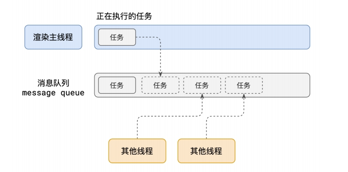
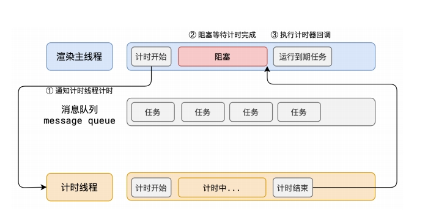
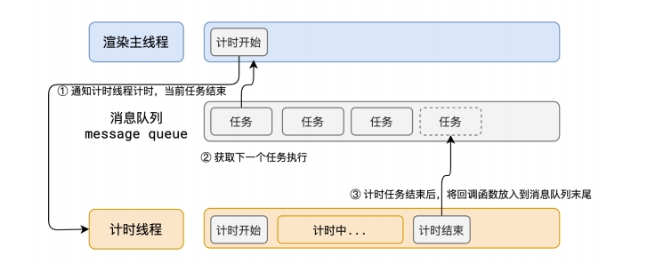

[[toc]]

## 引言

在现代前端开发中，异步操作几乎无处不在：用户输入、网络请求、定时任务、甚至动画效果。然而，为什么当你点击按钮时事件处理器并没有立即响应？又为何某些异步代码可以“跳过排队”提前执行？

这一切背后的原理，都归结于 浏览器事件循环（Event Loop）。这是 JavaScript 实现异步操作的关键机制，也是前端性能优化和代码调试中不可或缺的基础知识。

## 进程

在操作系统中最核心的概念就是进程，进程是对正在运行中的程序的一个抽象，是系统进行资源分配和调度的基本单位。
其实就是程序运⾏需要有它⾃⼰专属的内存空间，可以把这块内存空间简单的理解为进程。每个应⽤⾄少有⼀个进程，进程之间相互独⽴，即使要通信，也需要双⽅同意。

## 线程

线程（thread）是操作系统能够进行运算调度的最小单位，其是进程中的一个执行任务（控制单元），负责当前进程中程序的执行。

一个进程至少有一个线程，一个进程可以运行多个线程，这些线程共享同一块内存，线程之间可以共享对象、资源，如果有冲突或需要协同，还可以随时沟通以解决冲突或保持同步。

线程和进程是有很大区别的：

* 本质区别：进程是操作系统资源分配的基本单位，而线程是任务调度和执行的基本单位；
* 从属关系不同：进程中包含了线程，线程属于进程。一个进程可以有很多线程，每条线程并行执行不同的任务。一条线程指的是进程中一个单一顺序的控制流，一个进程中可以并发多个线程，每条线程并行执行不同的任务。
* 所处环境：在操作系统中能同时运行多个进程（程序）；而在同一个进程（程序）中有多个线程同时执行（通过CPU调度，在每个时间片中只有一个线程执行）
* 拥有资源不同：每个进程有自己的内存和资源，一个进程中的线程会共享这些内存和资源。进程是资源分配的基本单位。所有与该进程有关的资源，都被记录在进程控制块PCB中。以表示该进程拥有这些资源或正在使用它们。另外，进程也是抢占处理机的调度单位，它拥有一个完整的虚拟地址空间。当进程发生调度时，不同的进程拥有不同的虚拟地址空间，而同一进程内的不同线程共享同一地址空间。
* 控制与影响能力不同：子进程无法影响父进程，而子线程可以影响父线程，如果主线程发生异常会影响其所在进程和子线程。与进程相对应，线程与资源分配无关，它属于某一个进程，并与进程内的其他线程一起共享进程的资源。
* CPU利用率不同：进程的CPU利用率较低，因为上下文切换开销较大，而线程的CPU的利用率较高，上下文的切换速度快。在多核或多CPU，或支持Hyper-threading的CPU上使用多线程程序设计的好处是显而易见，即提高了程序的执行吞吐率。在单CPU单核的计算机上，使用多线程技术，也可以把进程中负责I/O处理、人机交互而常被阻塞的部分与密集计算的部分分开来执行，编写专门的workhorse线程执行密集计算，从而提高了程序的执行效率。

## 浏览器线程与进程

浏览器是⼀个多进程多线程的应⽤程序。这个是因为进程中的任意一线程执行出错，都会导致整个进程的崩溃。浏览器为了避免相互影响，减少连环崩溃的⼏率，它采用多进程和多进程。

### 多进程方面

* 稳定性提升：
当一个页面或插件所在进程崩溃时，仅影响当前页面进程或插件进程，不会导致整个浏览器崩溃。如在多进程浏览器中，若某一网页因代码问题或插件故障崩溃，其他正常网页的浏览不受干扰，与单线程浏览器中一个插件崩溃就引起整个浏览器崩溃形成鲜明对比 。
* 流畅性改善：
独立运行避免阻塞：不同页面的 JavaScript 运行在各自的渲染进程中，一个页面的 JavaScript 阻塞渲染进程，只影响当前页面，不会造成整个浏览器卡顿。像 Chrome 浏览器中一个页面有死循环脚本，仅该页面失去响应，其他页面仍可正常操作。
* 内存管理更优：
关闭页面时，其对应的渲染进程也关闭，系统可回收该进程占用的内存，有效解决了单进程浏览器长时间使用内存占用过高、越用越慢的问题。
* 安全性增强：
利用安全沙箱机制，将插件进程和渲染进程锁在沙箱内，沙箱内程序能运行，但无法在硬盘敏感位置读写数据，即使有恶意程序在这些进程中执行，也无法获取系统权限，保障了系统安全，避免了单线程浏览器中页面易获取浏览器所有权限从而攻击操作系统的风险。

### 多线程方面

* 提高响应速度：在浏览器的运行中，不同的任务可以分配到不同的线程去执行。比如，一个线程负责页面渲染，一个线程负责处理用户交互事件，一个线程负责执行 JavaScript 脚本等。这样可以让浏览器同时处理多个任务，在执行复杂任务时不会阻塞其他任务的执行，提高了整体的响应速度和流畅度。
* 资源利用更高效：现代计算机通常具有多核心处理器，多线程可以充分利用这些核心资源。每个线程可以在不同的核心上并行执行，使 CPU 资源得到更充分的利用，提升了浏览器的性能和效率，避免了单线程只能在一个核心上顺序执行任务而导致的资源浪费。

## 事件循环

在浏览器的诸多进程中，最主要的进程有：

1. 浏览器进程
主要负责界⾯显示、⽤户交互、⼦进程管理等。浏览器进程内部会启动多个
线程处理不同的任务。
2. ⽹络进程
负责加载⽹络资源。⽹络进程内部会启动多个线程来处理不同的⽹络任务。
3. 渲染进程（本节课重点讲解的进程）
渲染进程启动后，会开启⼀个渲染主线程，主线程负责执⾏ HTML、CSS、JS 代码。默认情况下，浏览器会为每个标签⻚开启⼀个新的渲染进程，以保证不同的标签⻚之间不相互影响。

### 渲染主线程是如何工作的？

在渲染主线程中，通过排队，以队列来调度任务，使用异步的方式防止阻塞。

1. 在最开始的时候，渲染主线程会进⼊⼀个⽆限循环
2. 每⼀次循环会检查消息队列中是否有任务存在。如果有，就取出第⼀个任务执⾏，执⾏完⼀个后进⼊下⼀次循环；如果没有，则进⼊休眠状态。
3. 其他所有线程（包括其他进程的线程）可以随时向消息队列添加任务。新任务会加到消息队列的末尾。在添加新任务时，如果主线程是休眠状态，则会将其唤醒以继续循环拿取任务这样⼀来，就可以让每个任务有条不紊的、持续的进⾏下去了。

这么一个过程被称为事件循环也叫消息循环。

### 何为异步？

代码在执⾏过程中，会遇到⼀些⽆法⽴即处理的任务，⽐如：

* 计时完成后需要执⾏的任务 —— setTimeout 、 setInterval
* ⽹络通信完成后需要执⾏的任务 -- XHR 、 Fetch
* ⽤户操作后需要执⾏的任务 -- addEventListener

如果让渲染主线程等待这些任务的时机达到，就会导致主线程⻓期处于「阻塞」的状态，从⽽导致浏览器「卡死」

因此，浏览器采用异步的方式来解决,当浏览器在执行某些操作时，不会阻塞其他操作的执行，而是允许它们同时进行，从而提高浏览器的性能和响应速度 。

### JS 异步

JS是⼀⻔单线程的语⾔，这是因为它运⾏在浏览器的渲染主线程中，⽽渲染主线程只有⼀个。⽽渲染主线程承担着诸多的⼯作，渲染⻚⾯、执⾏ JS 都在其中运⾏。如果使⽤同步的⽅式，就极有可能导致主线程产⽣阻塞，从⽽导致消息队列中的很多其他任务⽆法得到执⾏。这样⼀来，⼀⽅⾯会导致繁忙的主线程⽩⽩的消耗时间，另⼀⽅⾯导致⻚⾯⽆法及时更新，给⽤户造成卡死现象。所以浏览器采⽤异步的⽅式来避免。具体做法是当某些任务发⽣时，⽐如计时器、⽹络、事件监听，主线程将任务交给其他线程去处理，⾃身⽴即结束任务的执⾏，转⽽执⾏后续代码。当其他线程完成时，将事先传递的回调函数包装成任务，加⼊到消息队列的末尾排队，等待主线程调度执⾏。
在这种异步模式下，浏览器永不阻塞，从⽽最⼤限度的保证了单线程的流畅运⾏。

### 关于浏览器的队列优先级

在⽬前 chrome 的实现中，⾄少包含了下⾯的队列：

* 延时队列：⽤于存放计时器到达后的回调任务，优先级「中」
* 交互队列：⽤于存放⽤户操作后产⽣的事件处理任务，优先级「⾼」
* 微队列：⽤户存放需要最快执⾏的任务，优先级「最⾼」
* 动画队列：动画帧队列，它们在下一次重绘之前执行，优先级「次⾼」
* 渲染队列：浏览器专门用来处理页面的重绘（Repaint）和重排（Reflow）的队列，优先级「渲染队列的任务会在微任务执行完毕后、宏任务开始前执行，与动画队列有关」
* ⽹络队列：⽹络请求队列，优先级「低」
* 文件读取队列：文件读取队列，优先级「低」

## 参考文献

[https://worktile.com/kb/p/36374](https://worktile.com/kb/p/36374)
