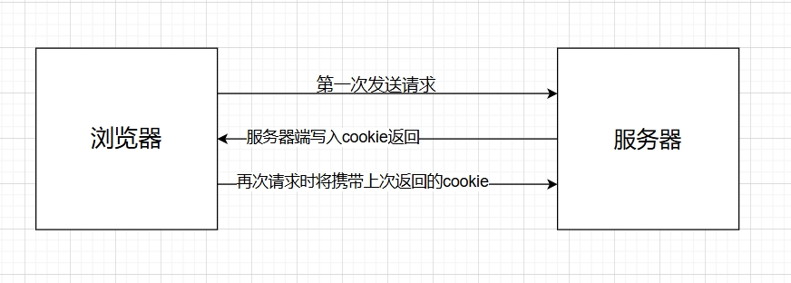
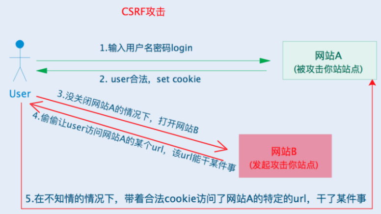

[[toc]]

## 引言

Web 存储是指允许 Web 应用程序在浏览器中存储数据的客户端存储机制。这包括会话存储、本地存储、Cookie 和 IndexedDB 等技术。在客户端提供存储空间对于许多标准 Web 功能（如购物车、游戏分数、用户首选项、动态页面内容和离线访问数据）至关重要。

在 Google Chrome 中，您可以通过打开发人员工具窗口并转到“应用程序”选项卡来查看 Web 存储，如下所示：


本文主要介绍sessionStorage、localStorage、Cookie以及indxDB，从数据存储位置、生命周期、存储大小、写入方式、数据共享、发送请求时是否携带、 安全性、浏览器兼容性、使用方法、应用场景等来介绍。

## localStorage,sessionStorage,Cookie

### 1.数据存储

Cookie、SessionStorage、 LocalStorage都是浏览器的本地存储，存储于浏览器本地。
cookie是由服务器端写入的，而sessionStorage、 localStorage都是由前端写入的;
cookie的存储空间比较小大概4KB，SessionStorage、 LocalStorage存储空间比较大，大概5M。

### 2.生命周期

#### sessionStorage

sessionStorage 为每一个给定的源（origin）维持一个独立的存储区域，该存储区域在页面会话期间可用.这个会话期间的存储的意思是说只要这个浏览器窗口没有关闭，那么数据就一直在，即使刷新页面或进入同源另一页面，数据仍然存在。但如果打开了新的浏览器窗口，或者浏览器被关闭了，那么数据就丢失了，并且这个数据永远不会被传输到服务器。

#### localStorage

localStorage 允许 JavaScript 站点和应用程序在浏览器中存储键/值数据，没有到期日期。即使浏览器关闭并重新打开，数据也会保留。

#### Cookie

Cookie 本质上就是浏览器里面存储的一个很小的文本文件，内部以键值对的方式来存储，并且Cookie一般是由服务器写入的，可通过`max-age`设置cookie有效时间，还可通过`httponly`,`samesite`,`secure`等属性来控制,在一定程度上保证服务器验证Cookie的安全。Cookie 的本职工作并非本地存储，而是  “维持状态”  。 因为 HTTP 协议是无状态的，HTTP 协议自身不对请求和响应之间的通信状态进行保存。



### 3.数据共享

Cookie、SessionStorage、 LocalStorage数据共享都遵循同源原则，SessionStorage还限制必须是同一个标签窗口，而如果是直接打开一个新的标签或窗口，不能共享，这个在处理同一个浏览器登录多个用户的时候会用到。

### 4.安全方面

在正常情况下,在前端给后端发送请求的时候会自动携带Cookie中的数据，但是SessionStorage、 LocalStorage不会。
WebStorage不会传送到服务器，存储在本地的数据可以直接获取，也不会像cookie一样每次请求都会传送到服务器，所以减少了客户端和服务器端的交互，节省了网络流量；但是容易受到XSS攻击，攻击者可以很容易的修改localStorage中的数据。我们通常如果需要进行一定防护的话，可以

同样的，cookie也很容易受到CSRF攻击，这是一种使已登录用户在不知情的情况下执行某种动作的攻击。因为攻击者看不到伪造请求的响应结果，所以CSRF攻击主要用来执行动作，而非窃取用户数据。



防范方法有以下几种：

* Referer校验，对HTTP请求的Referer校验，如果请求Referer的地址不在允许的列表中，则拦截请求。
* Token校验也就CSRF&nbsp;Token，服务端生成随机token，并保存在本次会话cookie中，用户发起请求时 附带token参数，
* 服务端对该随机数进行校验。如果不正确则认为该请求为伪造请求 拒绝该请求。
* 对于高安全性操作则可使用验证码、短信、密码等二次校验措施。

当然cookie也不一定会随请求发送，我们如果对cookie进行相关的domain，path,secure,sametime等进行相关设置，则可以进行相关的安全预防。

* domain:决定 cookie 能在哪些域名下被访问或发送。
* path:决定 cookie 可在哪些 URL 路径下被访问或发送,如果不设置 Path，默认值为当前页面的路径及其子路径。
* Secure:指定 cookie 仅在 HTTPS 连接时发送,如果请求是通过 HTTP 发起的，设置了 Secure 的 cookie 不会被发送。
* SameSite:控制跨站请求时 cookie 是否发送。

### 使用场景

#### sessionStorage的使用

* 在结帐前在页面之间存储购物车。
* 存储单个会话的用户首选项或设置。
* 存储单个会话的用户首选项或设置。

#### localStorage的使用

* 缓存应用 API 的身份验证令牌
* 存储应用程序的用户首选项或设置
* 保存表单数据，以便用户在意外关闭选项卡时不会丢失其输入
* 跟踪缓存的数据或图像以提高性能

#### Cookie的使用

* 会话管理和身份验证
* 主题背景等用户偏好设置

### 使用方法

```js
// Save data to sessionStorage
sessionStorage.setItem('name', 'John'); 

// Get saved data from sessionStorage
let name = sessionStorage.getItem('name');
```

```js
// Save data to sessionStorage
sessionStorage.setItem('name', 'John'); 
// Get saved data from sessionStorage
let name = sessionStorage.getItem('name');
const user = JSON.parse(localStorage.getItem('user'))
```

```js
// Save data to sessionStorage
sessionStorage.setItem('name', 'John'); 

// Get saved data from sessionStorage
let name = sessionStorage.getItem('name');
```

## indexedDB

IndexedDB 是一种底层 API，用于在客户端存储大量的结构化数据（也包括文件/二进制大型对象（blobs））
是浏览器本地数据库，有以下特点:

* 键值对储存：内部用对象仓库存放数据，所有类型的数据都可以直接存入，包括js对象，以键值对的形式保存，每条数据都有对应的主键，主键是唯一的
* 异步：indexDB操作时用户依然可能进行其他操作，异步设计是为了防止大量数据的读写，拖慢网页的表现
* 支持事务：比如说修改整个表的数据，修改了一半的时候报了个错，这时候会全部恢复到没修改之关的状态，不存在修改一半成功的情况
* 同源限制：每一个数据库应创建它对应的域名，网页只能访问自身域名下的数据库
* 存储空间大：一般来说不少于250MB，甚至没有上限
* 支持二进制存储：比如ArrayBuffer对象和Blob对象

### 使用流程

1. 打开数据库。
2. 在数据库中创建一个对象存储（object store）。
3. 启动事务，并发送一个请求来执行一些数据库操作，如添加或获取数据等。
4. 通过监听正确类型的 DOM 事件以等待操作完成。
5. 对结果进行一些操作（可以在 request 对象中找到）

```js
// 1. 打开或创建数据库
const openDatabase = (dbName, version = 1) => {
  return new Promise((resolve, reject) => {
    const request = indexedDB.open(dbName, version);

    // 创建 Object Store
    request.onupgradeneeded = (event) => {
      const db = event.target.result;
      if (!db.objectStoreNames.contains("images")) {
        const objectStore = db.createObjectStore("images", { keyPath: "id" });
        console.log("Object store 'images' created.");
      }
    };

    request.onsuccess = (event) => {
      console.log("Database opened successfully.");
      resolve(event.target.result);
    };

    request.onerror = (event) => {
      console.error("Database error:", event.target.error);
      reject(event.target.error);
    };
  });
};

// 2. 添加图片到数据库
const addImage = (db, id, imageBlob) => {
  return new Promise((resolve, reject) => {
    const transaction = db.transaction(["images"], "readwrite");
    const store = transaction.objectStore("images");
    const request = store.add({ id, image: imageBlob });

    request.onsuccess = () => {
      console.log("Image added with ID:", id);
      resolve(request.result);
    };

    request.onerror = (event) => {
      console.error("Add image error:", event.target.error);
      reject(event.target.error);
    };
  });
};

// 3. 获取图片
const getImage = (db, id) => {
  return new Promise((resolve, reject) => {
    const transaction = db.transaction(["images"], "readonly");
    const store = transaction.objectStore("images");
    const request = store.get(id);

    request.onsuccess = () => {
      if (request.result) {
        console.log("Image retrieved:", request.result);
        resolve(request.result.image);
      } else {
        console.error("No image found with ID:", id);
        reject("Image not found.");
      }
    };

    request.onerror = (event) => {
      console.error("Get image error:", event.target.error);
      reject(event.target.error);
    };
  });
};

// 4. 示例：存储并读取图片
(async () => {
  try {
    const dbName = "ImageDB";
    const db = await openDatabase(dbName);

    // 模拟获取图片并存储
    const imageUrl = "./1.png"; // 替换为你自己的图片 URL
    const response = await fetch(imageUrl);
    const imageBlob = await response.blob();

    // 添加图片到数据库
    await addImage(db, "exampleImage", imageBlob);

    // 从数据库中获取图片
    const retrievedBlob = await getImage(db, "exampleImage");

    // 将 Blob 转换为可显示的 URL 并插入到页面
    const imageUrlFromBlob = URL.createObjectURL(retrievedBlob);
    const imgElement = document.createElement("img");
    imgElement.src = imageUrlFromBlob;
    document.body.appendChild(imgElement);

    console.log("Image displayed from IndexedDB.");
  } catch (error) {
    console.error("Error handling images in IndexedDB:", error);
  }
})();

```

示例中的代码是可以存储图片，以进行缓存，应用场景一般为电商网站，对用户常访问的区域的图片进行缓存，可以存储到indexedDB中。这时候还可能涉及到LRU（Least Recently Used）策略是一种常见的缓存淘汰算法，用来管理缓存中的数据。它的核心思想是：当缓存空间不足时，淘汰最近最少使用的数据，以此来保持缓存的高效性和利用率。

在 IndexedDB 中使用 LRU 策略可以帮助我们控制数据库中存储的图片数量，并在存储空间有限时淘汰不再使用的数据，从而优化存储和读取性能。

### 优势

* 离线支持：IndexedDB 是浏览器提供的一个本地数据库，支持离线存储，用户在断网的情况下仍能查看已经缓存的图片。
* 持久性存储：与 LocalStorage 相比，IndexedDB 可以存储更大体量的数据（通常为数百 MB 甚至更多），更适合用来缓存图片。
* 异步操作：IndexedDB 是基于异步 API 的，因此在执行读写操作时不会阻塞主线程，确保用户的操作流畅。

## 参考文献

[https://www.freecodecamp.org/news/web-storage-api-how-to-store-data-on-the-browser/](https://www.freecodecamp.org/news/web-storage-api-how-to-store-data-on-the-browser/)
[https://www.ramotion.com/blog/what-is-web-storage/](https://www.ramotion.com/blog/what-is-web-storage/)
[https://developer.mozilla.org/zh-CN/docs/Web/API/Web_Storage_API](https://developer.mozilla.org/zh-CN/docs/Web/API/Web_Storage_API)
[https://juejin.cn/post/7260807979485773884](https://juejin.cn/post/7260807979485773884)
