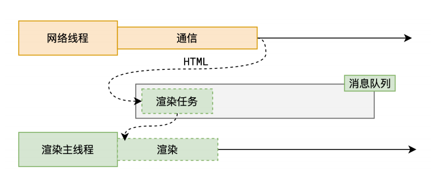
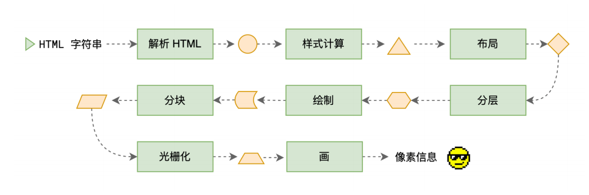
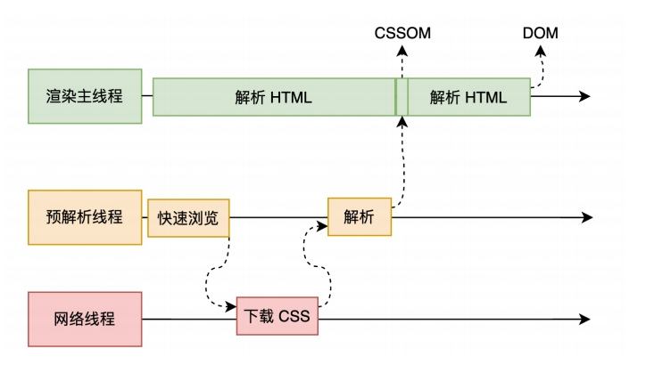
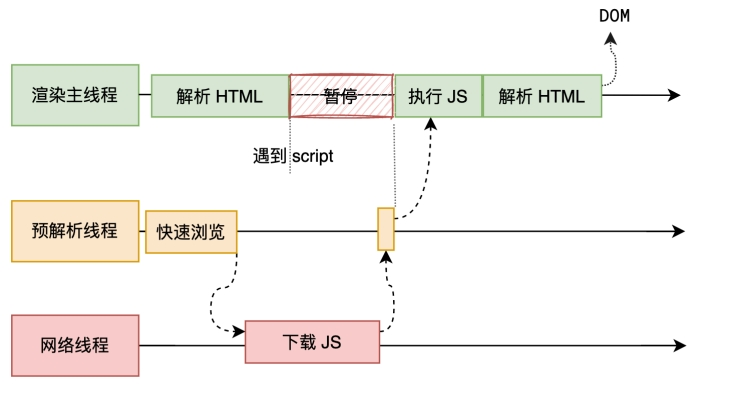
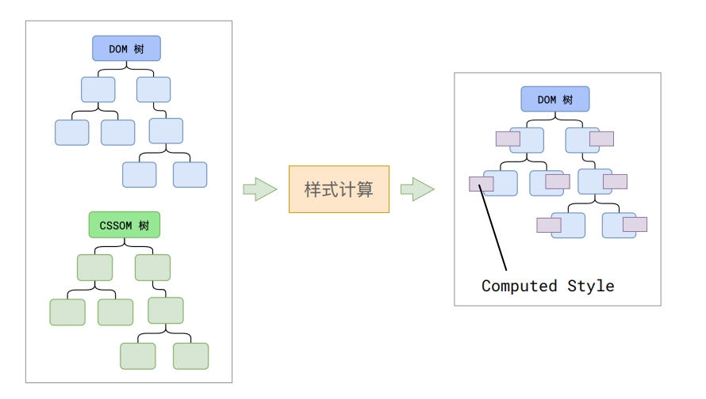
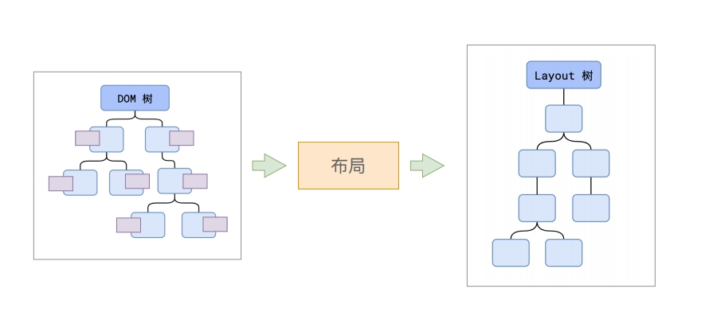
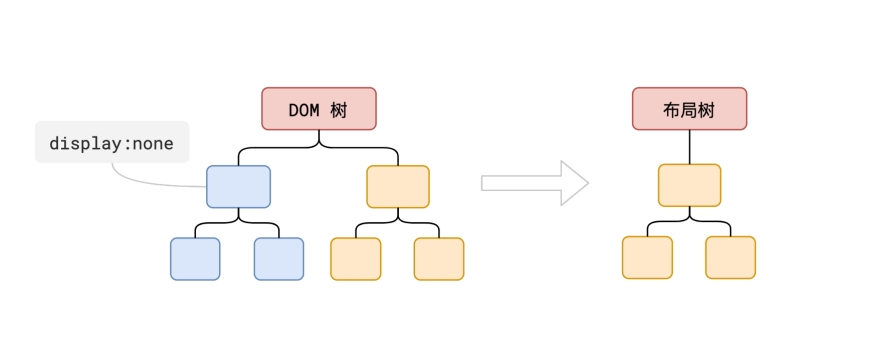
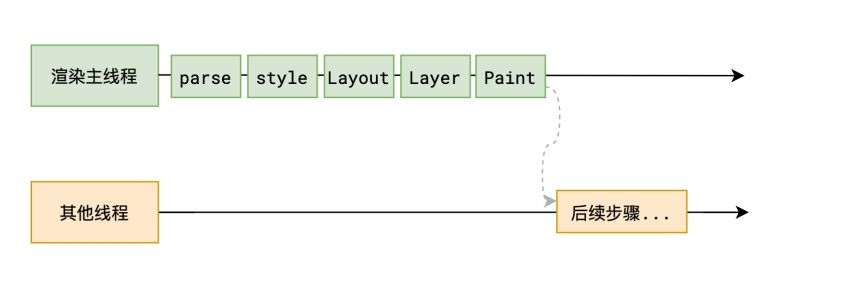
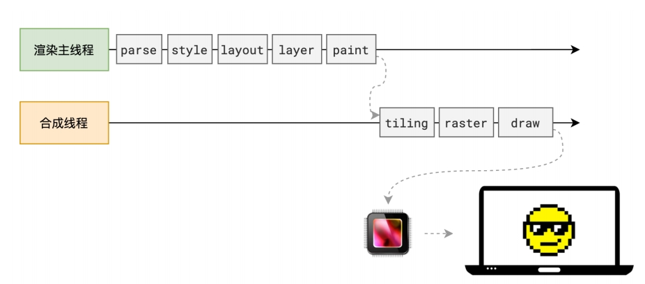

[[toc]]

## 引言

在浏览网页时，用户期望页面内容能够快速加载并且交互流畅。理解浏览器的渲染原理有助于开发者优化网站性能，从而提供更好的用户体验。

渲染时间节点
当浏览器的网络线程收到 HTML 文档后，会产生一个渲染任务，并将其传递给渲染主线程的消息队列。
在事件循环机制的作用下，渲染主线程取出消息队列中的渲染任务，开启渲染流程。

## 渲染过程

渲染流水线
整个渲染流程分为多个阶段，分别是： HTML 解析、样式计算、布局、分层、绘制、分块、光栅化、画
每个阶段都有明确的输入输出，上一个阶段的输出会成为下一个阶段的输入。
这样，整个渲染流程就形成了一套组织严密的生产流水线。

### 解析HTML

一旦浏览器收到第一个数据分块，它就可以开始解析收到的信息。“解析”是浏览器将通过网络接收的数据转换为 DOM 和 CSSOM 的步骤，通过渲染器在屏幕上将它们绘制成页面。  

首先处理 HTML 标记并构建 DOM 树，这个过程会占用浏览器主线程。因此，浏览器为了提高效率，会使用预加载扫描器加速这个过程。它会解析能获取到的内容，然后去请求像 CSS、JavaScript 和网页字体这类高优先级资源。因为有预加载扫描器，所以不用等解析器找到外部资源引用才去请求，它在后台就把资源检索了。这样当主 HTML 解析器解析到相关资源时，资源可能已经在下载或者都下载好了，预加载扫描器的优化能减少阻塞。当解析器碰到非阻塞资源，比如图片，浏览器会一边请求资源一边继续解析。要是遇到 CSS 文件，解析也能接着走，但碰到script标签（特别是没有 async 或 defer 属性的），就会阻塞渲染，HTML 解析也会停下来。

当主线程解析到link位置，此时外部的 CSS 文件如果还没有下载解析好，主线程不会等待，继续解析后续的 HTML。这是因为下载和解析 CSS 的工作是在预解析线程中进行的。这就是 CSS 不会阻塞 HTML 解析的根本原因。  

当主线程解析到script位置，会停止解析 HTML，转而等待 JS 文件下载好，并将全局代码解析执行完成后，才能继续解析 HTML。这是因为 JS 代码的执行过程可能会修改当前的 DOM 树，所以 DOM 树的生成必须暂停。这就是 JS 会阻塞 HTML 解析的根本原因。

因此在这个过程中，遇到 CSS 解析 CSS，遇到 JS 执行 JS。为了提高解析效率，浏览器在开始解析前，会启动一个预解析的线程，率先下载 HTML 中的外部 CSS 文件和 外部的 JS 文件。

第二步处理 CSS 并构建 CSSOM 树，CSSOM 和 DOM 相似，二者是独立的数据结构。浏览器会把 CSS 规则转变成可用的样式映射，遍历规则集依 CSS 选择器创建节点树。与处理 HTML 类似，浏览器对 CSS 也重复 HTML 到对象的过程，CSSOM 树包含用户代理样式表的样式，浏览器从通用规则开始，通过应用更具体规则递归优化计算样式，也就是级联属性值。  

这一阶段完成后，会得到 DOM 树和 CSSOM 树，浏览器的默认样式、内部样式、外部样式、行内样式均会包含在 CSSOM 树中。

### 样式计算

主线程会遍历得到的 DOM 树，依次为树中的每个节点计算出它最终的样式，称之为 Computed Style。

在这一过程中，很多预设值会变成绝对值，比如red会变成rgb(255,0,0)；相对单位会变成绝对单位，比如em会变成px。
这一步完成后，会得到一棵带有样式的 DOM 树。即得到一个渲染树-renderTree。

### 布局

布局阶段会依次遍历 DOM 树的每一个节点，计算每个节点的几何信息。例如节点的宽高、相对包含块的位置。
大部分时候，DOM 树和布局树并非一一对应。

比如display:none的节点没有几何信息，因此不会生成到布局树；又比如使用了伪元素选择器，虽然 DOM 树中不存在这些伪元素节点，但它们拥有几何信息，所以会生成到布局树中。还有匿名行盒、匿名块盒等等都会导致 DOM 树和布局树无法一一对应。

### 分层

主线程会使用一套复杂的策略对整个布局树中进行分层。
分层的好处在于，将来某一个层改变后，仅会对该层进行后续处理，从而提升效率。
滚动条、堆叠上下文、transform、opacity 等样式都会或多或少的影响分层结果，也可以通过will-change属性更大程度的影响分层结果。

### 绘制

主线程会为每个层单独产生绘制指令集，用于描述这一层的内容该如何画出来。
完成绘制后，主线程将每个图层的绘制信息提交给合成线程，剩余工作将由合成线程完成。
合成线程首先对每个图层进行分块，将其划分为更多的小区域。
它会从线程池中拿取多个线程来完成分块工作。

### 光栅化

合成线程会将块信息交给 GPU 进程，以极高的速度完成光栅化。
GPU 进程会开启多个线程来完成光栅化，并且优先处理靠近视口区域的块。
光栅化的结果，就是一块一块的位图

### 画

合成线程拿到每个层、每个块的位图后，生成一个个「指引（quad）」信息。
指引会标识出每个位图应该画到屏幕的哪个位置，以及会考虑到旋转、缩放等变形。
变形发生在合成线程，与渲染主线程无关，这就是transform效率高的本质原因。
合成线程会把 quad 提交给 GPU 进程，由 GPU 进程产生系统调用，提交给 GPU 硬件，完成最终的屏幕成像。

## 参考文献

渡一大师课
