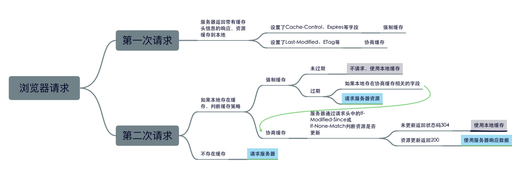
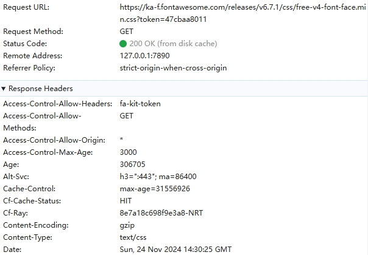
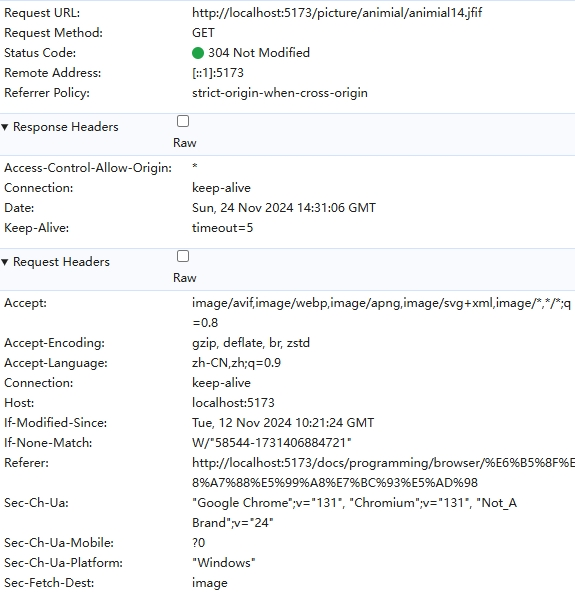

[[toc]]

## 引言

浏览器缓存是Web开发中提升网站性能的一个重要技术，它能有效减少页面加载时间，提高用户体验。通过缓存机制，浏览器可以存储静态资源（如图片、CSS、JavaScript文件等），避免重复请求，从而加快页面的加载速度。然而，理解如何合理配置和管理缓存机制是开发者的一项重要任务。本文将从浏览器缓存的基本概念入手，详细介绍常见的缓存策略与使用方法，并探讨其在不同应用场景中的实际运用，帮助开发者更好地利用这一技术优化Web应用性能。

## 为什么需要浏览器缓存？

缓存是指代理服务器或客户端磁盘内保存的资源副本。利用缓存可减少对服务器的访问，因此也就节省了通信流量和通信时间。
浏览器缓存是为了节约资源，并且可以加速浏览网站的速度，当用户第一次访问网页时，浏览器会根据缓存策略将请求的资源存储在内存或磁盘中。当用户再次访问时，浏览器会优先从本地缓存中获取资源，从而提高页面加载速度。

常见的浏览器缓存有强缓存，协商缓存，隐式缓存，内存缓存（Memory Cache），本文重在介绍最常见的两个缓存策略强缓存和协商缓存。

对于这两种缓存，他们分别从新鲜度和校验值两个维度来规定浏览器是直接使用缓存中的副本，还是需要去源服务器获取更新的版本。

**新鲜度（过期机制）**：也就是缓存副本有效期。一个缓存副本必须满足以下任一条件，浏览器会认为它是有效的，足够新的，而直接从缓存中获取副本并渲染。

* 含有完整的过期时间控制头信息（HTTP 协议报头），并且仍在有效期内浏览器；
* 已经使用过这个缓存副本，并且在一个会话中已经检查过新鲜度。

**校验值（验证机制）**：服务器返回资源的时候有时在控制头信息带上这个资源的实体标签 Etag（Entity Tag），它可以用来作为浏览器再次请求过程的校验标识。如过发现校验标识不匹配，说明资源已经被修改或过期，浏览器需求重新获取资源内容。

### 使用流程

## 强缓存

强缓存，利用HTTP的返回头中的expires和cache-control两个字段来控制，用来表示资源的缓存时间（缓存的有效期）。并且强缓存如果命中，浏览器直接从自己的缓存中读取资源，不会发请求到服务器。

### expires

该字段是http1.0时的规范，它的值为一个绝对时间的GMT格式的时间字符串，比如 Expires:Mon,18 Oct 2066 23:59:59 GMT。

这个时间代表着这个资源的失效时间，在此时间之前，即命中缓存。这种方式有一个明显的缺点，由于失效时间是一个绝对时间，所以当服务器与客户端时间偏差较大时，就会导致缓存混乱。

同时还有一个就是如果服务器数据进行了更新，而强缓存的有效期还没有过期的话，则数据无法更新。

### Cache-Control

Cache-Control 是 http1.1 时出现的 header 信息，主要是利用该字段的 max-age 值来指定设置缓存最大的有效时间，定义的是时间长短，它是一个相对时间。例如：Cache-Control:max-age=3600，代表着资源的有效期是3600秒。当浏览器向服务器发送请求后，在 max-age 这段时间里浏览器就不会再向服务器发送请求了。并且即使服务器上的资源发生了变化，浏览器也不会得到通知。

cache-control 除了该字段外，还有下面一些其他的设置值：

* s-maxage：同 max-age，只用于共享缓存（比如 CDN 缓存），在此时间内，即使更新了 CDN 的内容，浏览器也不会进行请求。也就是说 max-age 用于普通缓存，而 s-maxage 用于代理缓存。如果存在 s-maxage，则会覆盖掉 max-age 和 Expires header。
* no-cache：不使用本地缓存。需要使用缓存协商，先与服务器确认返回的响应是否被更改，如果之前的响应中存在ETag，那么请求的时候会与服务端验证，如果资源未被更改，则可以避免重新下载。
* no-store：直接禁止游览器缓存数据，每次用户请求该资源，都会向服务器发送一个请求，每次都会下载完整的资源。
* public：可以被所有的用户缓存，包括终端用户和CDN等中间代理服务器。
* private：只能被终端用户的浏览器缓存，不允许CDN等中继缓存服务器对其缓存。
* must-revalidate： 指定如果页面是过期的，则去服务器进行获取。
Cache-Control 与 Expires 可以在服务端配置同时启用，同时启用的时候 Cache-Control 优先级高。

### 强缓存原理

* **缓存判断**:当浏览器第一次请求某个资源时，服务器会返回该资源以及相关的缓存控制信息（通过 Cache-Control 或 Expires 头部）。浏览器会根据这些信息决定缓存资源的位置及有效期。

* **缓存有效期**:在缓存有效期内，浏览器每次请求该资源时，都直接从缓存中读取，而不向服务器发起请求，这样就达到了加速加载的效果。
* **缓存过期**：当缓存的有效期过后，浏览器会重新向服务器发起请求，获取资源，并重新更新缓存。

## 协商缓存

协商缓存就是由服务器来确定缓存资源是否可用，所以客户端与服务器端要通过某种标识来进行通信，从而让服务器判断请求资源是否可以缓存访问。

这主要涉及到下面两组 header 字段，这两组搭档都是成对出现的，即第一次请求的响应头带上某个字段（ Last-Modified 或者 Etag ），则后续请求则会带上对应的请求字段（ If-Modified-Since 或者 If-None-Match ），若响应头没有 Last-Modified 或者 Etag 字段，则请求头也不会有对应的字段。

### Last-Modify/If-Modify-Since

浏览器第一次请求一个资源的时候，服务器返回的header中会加上Last-Modify，Last-modify是一个时间标识该资源的最后修改时间，例如Last-Modify: Thu,31 Dec 2037 23:59:59 GMT。

当浏览器再次请求该资源时，request的请求头中会包含If-Modify-Since，该值为缓存之前返回的Last-Modify。服务器收到If-Modify-Since后，根据资源的最后修改时间判断是否命中缓存。

如果命中缓存，则返回304，并且不会返回资源内容，并且不会返回Last-Modify。

### ETag/If-None-Match

与 Last-Modify/If-Modify-Since 不同的是，Etag/If-None-Match 返回的是一个校验码。ETag 可以保证每一个资源是唯一的，资源变化都会导致 ETag 变化。服务器根据浏览器上送的 If-None-Match 值来判断是否命中缓存。

与 Last-Modified 不一样的是，当服务器返回304 Not Modified 的响应时，由于 ETag 重新生成过，response header 中还会把这个 ETag 返回，即使这个 ETag 跟之前的没有变化。

* 基于文件内容的哈希值：如果 ETag 是基于文件内容的哈希值生成的，那么只要文件内容不变，每次返回的 ETag 都会相同。例如，MD5、SHA 等哈希算法生成的 ETag 在资源不变时保持一致。

* 基于文件修改时间或版本：有些服务器会使用资源的最后修改时间或版本号来生成 ETag。在这种情况下，只要资源没有发生任何变化，ETag 值就会相同。

* 随机生成或带有服务器特定的标识：有些服务器会在生成 ETag 时加入一些服务器特定的标识，甚至每次随机生成一个值。这种情况下，即使资源内容没有变化，ETag 也可能不同。

#### ETag强弱之分

* 强 ETag：强 ETag 精确表示资源的字节级内容。如果资源没有发生变化，服务器会返回相同的 ETag 值。通常，强 ETag 是基于资源的内容进行生成的，如文件的哈希值。因此，在资源完全相同时，强 ETag 值是相同的。

* 弱 ETag：弱 ETag 允许服务器只验证资源的“语义等效性”，即资源可能在某些细微部分发生了变化（例如，时间戳更新了，但内容并未改变）。弱 ETag 的值以 W/ 开头，它的值在小的内容更新时可能会不同，即使资源整体内容未变。

#### 为什么需要ETag

* 一些文件也许会周期性的更改，但是他的内容并不改变(仅仅改变的修改时间)，这个时候我们并不希望客户端认为这个文件被修改了，而重新GET；
* 某些文件修改非常频繁，比如在秒以下的时间内进行修改，(比方说1s内修改了N次)，If-Modified-Since能检查到的粒度是s级的，如果不超过1s内不会检测到资源发送改变。（UNIX文件系统记录的文件修改时间（MTIME）通常精确到秒）
* 某些服务器不能精确的得到文件的最后修改时间。 Last-Modified与ETag是可以一起使用的，服务器会优先验证ETag，一致的情况下，才会继续比对Last-Modified，最后才决定是否返回304。并且，因为Etghash值内容是唯一的，通过对比就很快知道资源是否发送改变。

## 区别

### 是否发送到服务器

| 缓存类型   | 获取资源形式 | 状态码           | 发送请求到服务器 |
|------------|--------------|------------------|------------------|
| 强缓存     | 从缓存取     | 200（from cache）| 否，直接从缓存取 |
| 协商缓存   | 从缓存取     | 304（Not Modified）| 否，通过服务器来告知缓存是否可用 |

### 用户行为对缓存的影响

| 用户操作           | Expires/Cache-Control | Last-Modified/Etag |
|--------------------|-----------------------|---------------------|
| 地址栏回车         | 有效                  | 有效                |
| 页面链接跳转       | 有效                  | 有效                |
| 新开窗口           | 有效                  | 有效                |
| 前进回退           | 有效                  | 有效                |
| F5刷新             | 无效                  | 有效                |
| Ctrl+F5强制刷新    | 无效                  | 无效                |

**小技巧**：

* 使用 Ctrl+F5 强制刷新页面时，会对本地缓存文件直接过期，然后跳过强缓存和协商缓存，直接请求服务器
* 点击刷新或 F5 刷新页面时，对本地缓存文件过期，然后带If-Modifed-Since和If-None-Match发起协商缓存验证新鲜度

### 应用

| 缓存类型     | 应用场景                                  | 优点                            | 注意事项                         |
|--------------|-------------------------------------------|---------------------------------|----------------------------------|
| 强缓存       | 静态资源（图片、字体、第三方库等）          | 提升性能、减少服务器压力         | 必须配合版本控制以防止缓存问题    |
| 协商缓存     | 动态内容或频繁变化资源（接口数据、配置文件） | 确保资源实时性、节省带宽         | 每次发起请求会有一定的性能开销    |
| 强+协商缓存  | 静态资源优先强缓存，动态资源优先协商缓存     | 性能与实时性的平衡               | 需要合理配置 HTTP 缓存头部        |

## 缓存位置

浏览器缓存的存储位置可以影响缓存的性能和行为。根据资源的类型和缓存策略，缓存会存储在以下位置之一：

### 1. **Service Worker**

Service Worker 是一种运行在浏览器独立线程中的脚本，主要用于管理资源缓存和处理网络请求。它通过拦截网络请求，将资源缓存到一个独立的缓存存储区中，从而实现离线访问和提升加载速度。有如下特点：

* 运行环境：独立于页面线程，不受页面生命周期影响。
* 缓存粒度：开发者可以精确控制缓存内容，支持动态缓存更新。
* 安全性：只能通过 HTTPS 协议运行，保障安全性。
* 应用场景：离线缓存（PWA）、预加载资源、减少网络延迟。

| 优点                     | 缺点                               |
|--------------------------|------------------------------------|
| 可以完全控制缓存策略      | 开发和调试复杂                     |
| 支持离线访问              | 对 HTTPS 环境有强依赖              |
| 精确的缓存管理和更新      | 存储大小有限，适用于轻量级资源     |

### 2. Memory Cache

Memory Cache 是将资源缓存在浏览器的内存中，通常用于存储当前会话中临时加载的资源，如正在使用的脚本或图片。有如下特点：

* 存储位置：保存在浏览器内存（RAM）中，页面关闭时会被清除。
* 加载速度快：由于存储在内存中，读取资源的速度极快。
* 存储时间短：仅适合临时使用的资源缓存。
* 应用场景：页面之间频繁使用的短期资源，如图片和样式表。提升当前页面加载性能，但不适合长期缓存。

| 优点                     | 缺点                               |
|--------------------------|------------------------------------|
| 读取速度快                | 存储时间短，页面关闭后即失效       |
| 适合小型资源缓存          | 受内存限制，不适合大资源缓存       |

### 3. Disk Cache

Disk Cache 是将资源缓存在本地磁盘中，主要用于存储需要长期保留的资源，如静态文件和第三方库。有如下特点：

* 存储位置：资源存储在浏览器的本地存储目录中（磁盘）。
* 容量较大：相较 Memory Cache，可以存储更多资源。
* 存储时间长：即使浏览器关闭，资源也能保留。
* 应用场景：静态资源（图片、字体文件、JS 和 CSS 代码）缓存，可跨会话使用的长期资源缓存。

| 优点                     | 缺点                               |
|--------------------------|------------------------------------|
| 存储容量大                | 读取速度较慢（相较于内存缓存）     |
| 支持长期存储              | 需要管理磁盘空间和清理策略         |

### 4. Push Cache（推送缓存）

Push Cache 是 HTTP/2 中的缓存功能，用于在会话（Session）级别存储资源。与其他缓存不同，Push Cache 的存活时间非常短，仅在会话生命周期内有效。有如下特点：

* 存储时间短：通常只在会话中有效，关闭会话后缓存即被清除。
* 优先级低：只有当资源不在其他缓存位置时，才会使用 Push Cache。
* 传输机制：通过服务器主动推送资源到客户端。
* 应用场景：用于首次加载时预加载关键资源，提升首屏渲染速度，动态内容或可能被频繁修改的资源的临时缓存。

| 优点                     | 缺点                               |
|--------------------------|------------------------------------|
| 可提升首次加载速度        | 存活时间短，不适合长期缓存         |
| 减少关键资源加载延迟      | 浏览器支持有限，应用场景较局限     |

### 简单总结

| 缓存类型        | 存储位置          | 生效时间                     | 存储时间长短               | 应用场景                                  |
|-----------------|-------------------|------------------------------|----------------------------|-------------------------------------------|
| Service Worker  | 独立线程          | 受开发者控制                 | 可长期存储                 | 离线缓存、PWA、动态资源预加载            |
| Memory Cache    | 内存（RAM）       | 页面加载后立即生效           | 页面关闭后失效             | 短期资源缓存，适合页面频繁使用的小文件  |
| Disk Cache      | 磁盘               | 页面加载后立即生效           | 长期存储（跨会话）          | 静态资源缓存，大文件、跨会话持久化      |
| Push Cache      | 会话级缓存        | 仅在会话生命周期内有效       | 存活时间极短               | HTTP/2 的临时缓存，提升首次加载性能     |

## 参考文献

[https://www.freecodecamp.org/chinese/news/an-introduction-to-the-browser-cache-mechanism/](https://www.freecodecamp.org/chinese/news/an-introduction-to-the-browser-cache-mechanism/)
