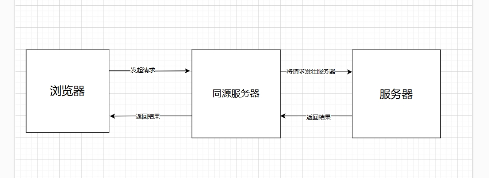

[[toc]]

## 引言

---

在现代前端开发中，跨域问题是一个常见的挑战。由于浏览器的同源策略（Same-Origin Policy），不同源之间的资源无法直接共享，除非采取一些特定的解决方法。本文将介绍三种常见的跨域方式：JSONP、CORS 和 代理，并详细讲解它们的工作原理和适用场景。

## 跨域

---

首先，我们先介绍一下何为跨域：在 Web 浏览器中，允许某个网页脚本访问另一个网页的数据，但前提是这两个网页必须有相同的 URI、主机名和端口号，若两个网站不满足上述任意一个条件就无法访问另一个网页数据，即为跨域。

## JSONP

---

### JSONP原理

JSONP（JSON with Padding）是一种通过 `<script>` 标签来进行跨域请求的技术。由于 `<script>` 标签不受同源策略的限制，可以从任意域加载外部资源，因此 JSONP 利用这一点，通过动态创建 `<script>` 标签发起跨域请求。其核心思想为：网页通过添加一个 `<script>` 元素，向服务器请求 JSON 数据，服务器收到请求后，将数据放在一个指定名字的回调函数的参数位置传回来。

```js
//前端
function handleResponse(data) {
  console.log(data);
}

// 动态创建 script 标签
const script = document.createElement('script');
script.src = 'https://example.com/api/data?callback=handleResponse';
document.body.appendChild(script);
//服务器返回 --->相当于返回handleResponse({ message: 'Hello from server!' })
const express = require('express');
const app = express();
const port = 3000;

app.get('/api/data', (req, res) => {
  const callback = req.query.callback;  // 获取回调函数名
  const data = { message: 'Hello from server!' };

  // 返回 JSONP 响应
  res.type('text/javascript');
  res.send(`${callback}(${JSON.stringify(data)})`);  // 调用回调函数并传入数据
});

app.listen(port, () => {
  console.log(`Server running at http://localhost:${port}`);
});

```

### JSONP缺点

* 只支持 GET 请求。
* 安全性较低，易受 XSS 攻击。
* 无法处理复杂数据类型，数据需经过特定格式化。

JSONP 主要用于需要跨域请求的数据，但因为它的限制和安全性问题，通常已经被现代浏览器技术所替代。

## CORS

### 什么是&nbsp;CORS？

CORS（Cross-Origin Resource Sharing）是一种基于 HTTP 头的机制，该机制通过允许服务器标示除了它自己以外的其他源（域、协议或端口），使得浏览器允许这些源访问加载自己的资源。跨源资源共享还通过一种机制来检查服务器是否会允许要发送的真实请求，该机制通过浏览器发起一个到服务器托管的跨源资源的“预检”请求。在预检中，浏览器发送的头中标示有 HTTP 方法和真实请求中会用到的头。

整个CORS通信过程，都是浏览器自动完成，不需要用户参与。对于开发者来说，CORS通信与同源的AJAX通信没有差别，代码完全一样。浏览器一旦发现AJAX请求跨源，就会自动添加一些附加的头信息，有时还会多出一次附加的请求，但用户不会有感觉。

因此，实现CORS通信的关键是服务器。只要服务器实现了CORS接口，就可以跨源通信。

### 什么情况需要&nbsp;CORS？

* 前文提到的由 XMLHttpRequest 或 Fetch API 发起的跨源 HTTP 请求。
* Web 字体（CSS 中通过 @font-face 使用跨源字体资源），因此，网站就可以发布 TrueType 字体资源，并只允许已授权网站进行跨站调用。
* WebGL 贴图。
* 使用 drawImage() 将图片或视频画面绘制到 canvas。
* 来自图像的 CSS 图形。

### CORS&nbsp;两种请求

#### 简单请求

根据&nbsp;[MDN文档](https://developer.mozilla.org/zh-CN/docs/Web/HTTP/CORS#%E5%8A%9F%E8%83%BD%E6%A6%82%E8%BF%B0)&nbsp;若请求满足所有下述条件，则该请求可视为简单请求：

使用下列方法之一：

* GET
* HEAD
* POST
* 除了被用户代理自动设置的标头字段（例如 Connection、User-Agent 或其他在 Fetch 规范中定义为禁用标头名称的标头），允许人为设置的字段为 Fetch 规范定义的对 CORS 安全的标头字段集合。该集合为：

  * Accept
  * Accept-Language
  * Content-Language
  * Content-Type（需要注意额外的限制）
  * Range（只允许简单的范围标头值 如 bytes=256- 或 bytes=127-255）
  * Content-Type 标头所指定的媒体类型的值仅限于下列三者之一：

    `text/plain`
    `multipart/form-data`
    `application/x-www-form-urlencoded`

* 如果请求是使用 XMLHttpRequest 对象发出的，在返回的 XMLHttpRequest.upload 对象属性上没有注册任何事件监听器；也就是说，给定一个 XMLHttpRequest 实例 xhr，没有调用 xhr.upload.addEventListener()，以监听该上传请求。
* 请求中没有使用 ReadableStream 对象。

当浏览器发起一个简单请求时，它会自动判断该请求是否跨域。如果是跨域请求，浏览器会根据 CORS 策略来处理响应，确保安全性。对于简单请求，浏览器只会发送一个简单的请求，并且不进行预检（预检请求是用于检测跨域请求是否被服务器允许的 OPTIONS 请求）。这意味着，浏览器会直接发送请求，并在收到响应后根据 CORS 策略判断是否允许访问响应内容。那么对于服务器而言，只需要设置` Access-Control-Allow-Origin：*; `头部即可(或者设置为自己允许的域名),它告诉浏览器是否允许跨域访问该资源,` * `表示允许所有域进行跨域访问。

除此之外，还有一些其他相关的字段，都以Access-Control-开头

* `Access-Control-Allow-Credentials :`该字段可选。它的值是一个布尔值，表示是否允许发送Cookie。默认情况下，Cookie不包括在CORS请求之中。设为true，即表示服务器明确许可，Cookie可以包含在请求中，一起发给服务器。这个值也只能设为true，如果服务器不要浏览器发送Cookie，删除该字段即可。
* `Access-Control-Allow-Headers :`该字段可选。该字段可选。CORS请求时，XMLHttpRequest对象的getResponseHeader()方法只能拿到6个基本字段：`Cache-Control`、`Content-Language :`、`Content-Type`、`Expires`、`Last-Modified`、`Pragma`。这些响应头字段主要用于控制缓存、编码、语言、以及响应的时间等,如果想拿到其他字段，就必须在` Access-Control-Expose-Headers `里面指定。
* `Access-Control-Allow-Credentials :`CORS请求默认不发送Cookie和HTTP认证信息。如果要把Cookie发到服务器，一方面要服务器同意，指定Access-Control-Allow-Credentials字段。另一方面需要在前端请求中也打开` withCredentials ` 选项。
* `Access-Control-Request-Method :`该字段是必须的,用来列出浏览器的CORS请求会用到哪些HTTP方法.
* `Access-Control-Request-Headers :`该字段是一个逗号分隔的字符串，指定浏览器CORS请求会额外发送的头信息字段.

### 预检请求

与简单请求不同，“需预检的请求”要求必须首先使用 OPTIONS 方法发起一个预检请求到服务器，以获知服务器是否允许该实际请求。"预检请求“的使用，可以避免跨域请求对服务器的用户数据产生未预期的影响。

"预检"请求用的请求方法是OPTIONS，表示这个请求是用来询问的。头信息里面，关键字段是Origin，表示请求来自哪个源，以及还有一个Access-Control-Request-Method，表示请求方法，还有Access-Control-Request-Headers，表示请求的头信息字段。

服务器收到"预检"请求以后，检查了Origin、Access-Control-Request-Method和Access-Control-Request-Headers字段以后，确认允许跨源请求，就可以做出回应。

如果服务器否定了"预检"请求，会返回一个正常的HTTP回应，但是没有任何CORS相关的头信息字段。这时，浏览器就会认定，服务器不同意预检请求，因此，跨域实际上是服务器可以正常响应，但是浏览器给拦截了，所以需要服务器回复的信息中含有CORS相关信息。包括以下：

* `Access-Control-Allow-Methods :`该字段必需，它的值是逗号分隔的一个字符串，表明服务器支持的所有跨域请求的方法。注意，返回的是所有支持的方法，而不单是浏览器请求的那个方法。这是为了避免多次"预检"请求。
* `Access-Control-Allow-Headers :`如果浏览器请求包括Access-Control-Request-Headers字段，则Access-Control-Allow-Headers字段是必需的。它也是一个逗号分隔的字符串，表明服务器支持的所有头信息字段，不限于浏览器在"预检"中请求的字段。
* `Access-Control-Allow-Credentials :`可以携带cookie，默认不支持。
* `Access-Control-Max-Age :`该字段可选，用来指定本次预检请求的有效期，单位为秒，在该有效期间，对于相同的跨域请求不会再预检了。

#### 为什么预检请求使用options？

因为OPTIONS 请求是轻量级的，它包含了实际请求的一些信息（如请求方法和请求头），只会询问服务器是否允许跨域请求，且不会对服务器的资源进行实际的修改操作，目的就是确认请求的安全性和服务器的配置，避免直接发送可能不被允许的跨域请求，同时也避免了跨域请求过程中直接携带请求内容被拒绝时浪费带宽的情况，这样当options的请求得到结果后，就可以知道是否可以发送真正的请求了。

### 附带身份凭证的请求

当我们通过cookie身份凭证来验证用户身份时，首先需要前端发起请求，需要将Ajax的withCredentials属性设置为true，这样浏览器就会在请求头中携带Cookie信息，服务器才能识别用户身份，服务器返回cookie时也需要相关配置，否则会出现cookie发送不出去，或者前端无法携带cookie发送到服务器的情况。

#### 那么服务器端如何设置cookie呢？

* 服务器不能将 Access-Control-Allow-Origin 的值设为通配符“*”，而应将其设置为特定的域，如：`Access-Control-Allow-Origin: https://example.com`。
* 服务器不能将 Access-Control-Allow-Headers 的值设为通配符“*”，而应将其设置为标头名称的列表，如：`Access-Control-Allow-Headers: X-PINGOTHER, Content-Type`
* 服务器不能将 Access-Control-Allow-Methods 的值设为通配符“*”，而应将其设置为特定请求方法名称的列表，如：`Access-Control-Allow-Methods: POST, GET`

除此之外cookie还可以通过`secures`属性来设置，但是`secure`属性只能设置在https上，不能设置在http上。那么，如果设置了secure属性，那么只有在https上才能访问到cookie，在http上访问不到cookie。

以及samesite属性,有三个主要的值:`strict`,`lax`,`none`，默认为`lax`：

* Strict：仅在同站请求中发送 Cookie，不会在跨站请求中发送。这意味着当用户从一个外部站点跳转到当前站点时，Cookie 将不会被发送。
* Lax：仅在某些类型的跨站请求（如导航或链接点击）时，才会发送 Cookie。在这些跨站请求中，浏览器仍然会发送 Cookie，但在跨站的 POST 请求中不会发送 Cookie。
* None：无论是同站请求还是跨站请求，都会发送 Cookie。但是，当设置 `SameSite=None` 时，必须同时使用 `Secure` 属性，也就是说，这个 `Cookie` 只能通过 HTTPS 发送。

因此这也取决于你的前后端架构，如果前后端分离,分别采用不同的域名,就需要设置 `SameSite=None`，同时设置 `Secure`。这样的Cookie才可以在跨域的情况下传递。

## 代理

代理方法也是跨域常见的解决办法，代理方法是通过在同一域名下的服务器转发请求，从而避免浏览器的同源策略限制。代理方法的核心思想是，前端发送请求到自己的服务器（同源请求），然后由该服务器代为请求目标服务器，并将响应返回给前端。由于跨域只针对于浏览器，服务器和目标服务器不会受到浏览器的同源策略限制，因此这种方式能解决跨域问题。



1. 开发环境vite 配置代理

  ```js
  proxy: {
    //针对 /api 开头的请求
    '/api': {
      // target: 'http://localhost:3000',
      target: process.env.VITE_API_BASE_URL, //表示服务器地址
      changeOrigin: true,   
      rewrite: (path: any) => path.replace(/^\/api/, '') // 将 /api 替换成 target 目标地址
    }
  }
  ```

2. nginx 代理

```js
server {
  listen 80;   // 监听80端口,还可以监听其他的类似443端口
  server_name api.myserver.com; //这里表示你的服务器的域名

  location /api/ {
    proxy_pass https://api.example.com/;  //可以代理到你的服务器内部的接口
    proxy_set_header Host api.example.com; 
    proxy_set_header X-Real-IP $remote_addr;  // 代理服务器的真实IP
    proxy_set_header X-Forwarded-For $proxy_add_x_forwarded_for; 
  }
}

```

>最好的实践方法是确保开发环境和生产环境保持一致，这样就能避免在开发环境中一切正常，而在生产环境中出现各种问题的情况。如果使用 CORS，则前端可以取消代理配置，直接设置并配置相关的 CORS 字段，同时服务器也需要做出相应的 CORS 配置。如果选择使用代理，则可以通过 Nginx 来统一处理代理转发，确保前后端行为一致，避免环境差异带来的问题
>
## 参考文献

[https://developer.mozilla.org/zh-CN/docs/Web/HTTP/CORS](https://developer.mozilla.org/zh-CN/docs/Web/HTTP/CORS)
[https://www.ruanyifeng.com/blog/2016/04/cors.html](https://www.ruanyifeng.com/blog/2016/04/cors.html)
