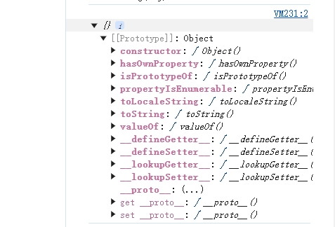
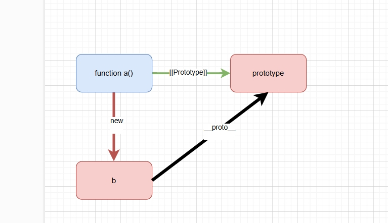
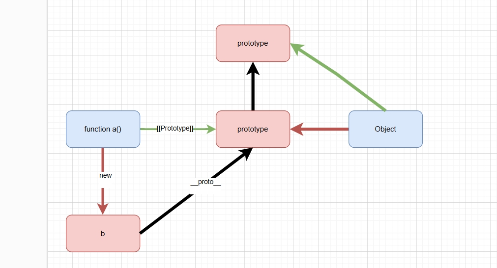
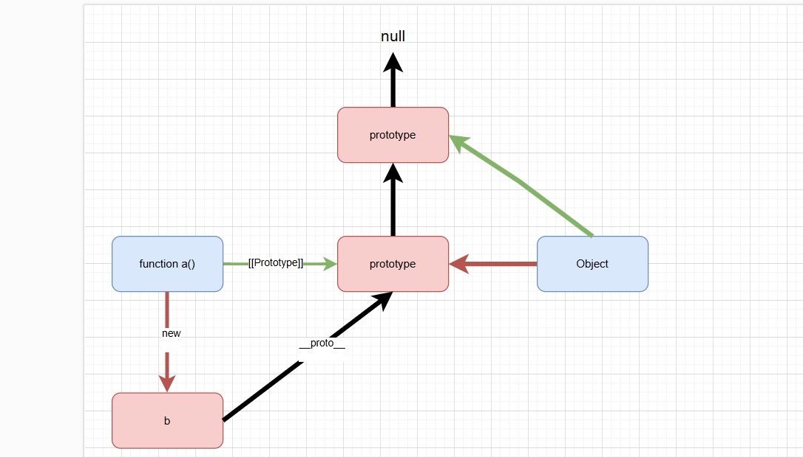
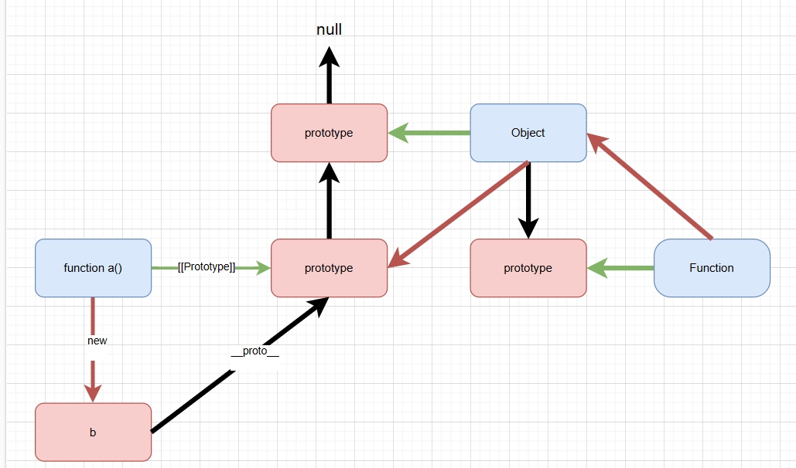
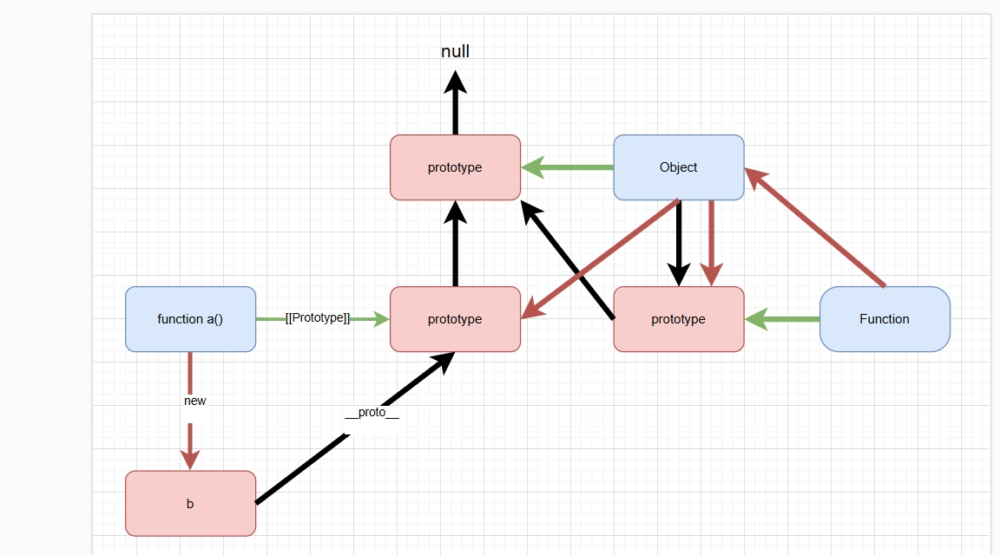
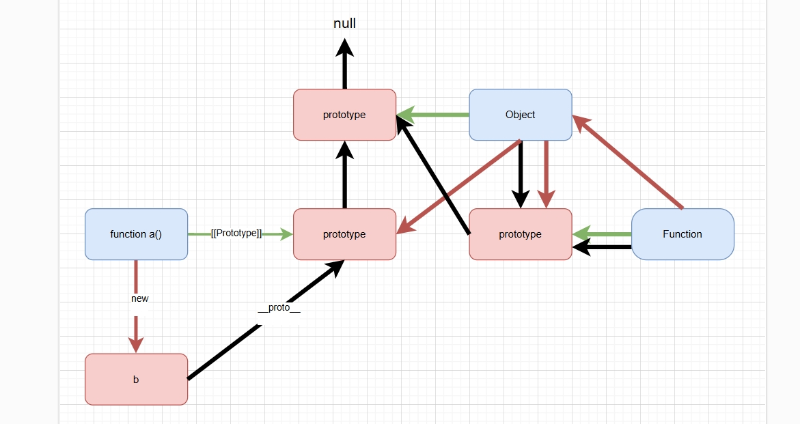
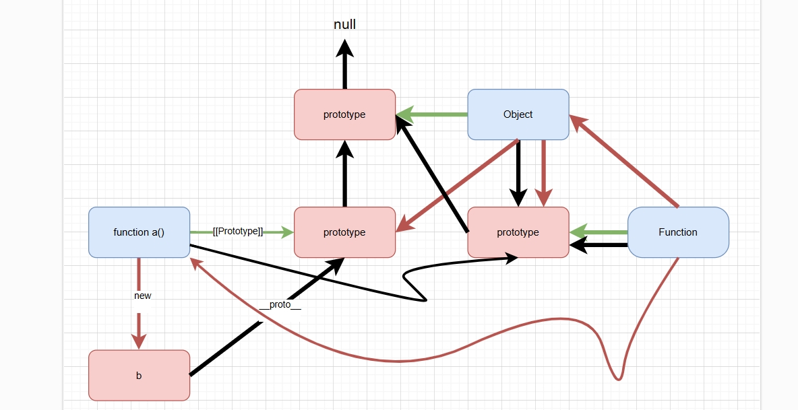

[[toc]]

## 引言

在 JavaScript 中，对象 是核心概念之一。几乎所有的数据结构（如数组、函数、甚至类）都依赖于对象来管理和存储数据。本篇文章将从 JavaScript 的类型系统出发，逐步讲解对象的概念，并通过简单易懂的三角关系图，直观地展示函数对象和普通对象如何通过原型链联系在一起。我们将一步步揭示原型链如何使得对象能够继承属性、方法，并让我们可以灵活地复用代码。通过这个过程，你将深入理解 JavaScript 的继承机制，并掌握如何高效地运用它。

## JavaScript 中的类型

js分为基本数据类型和对象。

基本数据类型有七种，Number,String,Bigint,Symbol, null, undefined, Boolean.

对象层面详细的阐述的话有很多，包括普通对象，函数对象，数组对象，正则对象，日期对象，Error对象以及Map，Set等等

```js
//普通对象
let person = {
  name: "Alice",
  age: 30
}; 
let anotherPerson = new Object();

//函数对象
function add(a, b) {
  return a + b;
}

//数组对象
let numbers = [1, 2, 3, 4, 5];

//日期对象
let now = new Date();

//正则对象
let anotherPattern = new RegExp("abc", "i");

//Map对象
let mySet = new Set();

//Set对象
let myMap = new Map();
```

但其实对象就分为两种，一种是可调用的对象即函数，另一种是不可调用的对象即普通对象。

## 原型链

在 JavaScript 中，原型链是一个非常重要的概念。JavaScript 使用对象实现继承。每个对象都有一条链接到另一个称作原型的对象的内部链。该原型对象有自己的原型，依此类推，直到原型是 null 的对象。根据定义，null 没有原型，并作为这条原型链中最后的一环。在运行时修改原型链的任何成员、甚至是换掉原型都是可能的

### 原型链的基本概念

当我们试图访问一个对象的属性时，它不仅仅在该对象上搜寻，还会搜寻该对象的原型，以及该对象的原型的原型，依次层层向上搜索，直到找到一个名字匹配的属性或到达原型链的末尾。那么我们需要知道两个概念：__proto__和[[Prototype]]

#### __proto__

在js中几乎每个对象都有一个名为 __proto__ 的属性，该属性指向该对象的原型。__proto__是我们接触原型链时绕不开的一个属性。简单来说，__proto__是绝大多数对象都自带的一个特殊属性，它直白地指向该对象的原型对象。打个比方，如果把对象比作一个人，__proto__就是这个人的家族血缘纽带，连接着它的 “先辈” 对象。但是 **MDN** 官方不推荐使用这个属性，因为这个属性是非标准的，并且我们最好不要去修改它。

但其实也有特殊情况,比如通过Object.create(null)创建的对象是一个非常纯粹的对象，它没有__proto__属性。这是因为这种方式创建的对象没有继承Object.prototype的属性和方法。还有的情况就是对于某些自定义对象，如果在某些特殊的编程场景下，通过Object.defineProperty等方式重新定义对象的属性，也有可能会修改或删除__proto__属性。

#### [[Prototype]]

相较于暴露在外的__proto__，[[Prototype]]显得更为神秘，它是 JavaScript 引擎内部使用的一个属性，不直接暴露在代码层面。[[Prototype]]本质上承载着对象间原型关联的核心逻辑，规定了对象继承关系与属性查找路径。[[Prototype]] 无法直接访问，但可以通过规范的方法（如 Object.getPrototypeOf()）获取。

### 原型链的基本原理

当访问对象的属性时，JavaScript 引擎会按以下顺序查找：

* 先在对象本身的属性中查找。
* 如果未找到，则会沿着对象的原型链向上查找。
* 如果遍历到 null（即原型链的终点），仍未找到属性，则返回 undefined。

## 原型链关系图

接下来，我将用一幅使用三角形关系的图表示原型链关系的图来展示 JavaScript 的原型链。

我们平常创建对象就是通过字面量{}来创建的，但其实在js内部会自动调用new Object()方法来创建对象，所以实际上创建对象的过程呢就是我们通过一个构造函数创建的。

```js
function createObj(){}
const a =  new createObj()
console.log(a)

const obj = {}
const b = new Object()
console.log(b)
```

在 JavaScript 中，函数可以拥有属性。除去箭头函数外的所有函数都有一个名为 prototype 的特殊属性。因为箭头函数不支持 this，所以没有 prototype 属性。这个prototype 属性其实就是一个普通对象，它记录着该函数的一些属性和方法,包括constructor属性。

```js
function doSomething() {}
console.log(doSomething.prototype);
// 你如何声明函数并不重要；
// JavaScript 中的函数总有一个默认的
// 原型属性——有一个例外：
// 箭头函数没有默认的原型属性：
const doSomethingFromArrowFunction = () => {};
console.log(doSomethingFromArrowFunction.prototype);
```



那么基于此，我们可以画出第一个三角关系，一个函数a,一个由函数创建的实例b,以及函数a的原型对象。蓝色的代表函数，红色的代表实例，绿色的代表原型对象。实例中会有一个隐式原型属性，指向原型对象。



那么这个prototype对象作为一个普通对象，是通过Object，new出来的。那么下一个三角关系就明确了。



那么如果这样下去就无穷无尽了，js规定，Object的原型对象指向null，作为原型链的终点。



那么在这个图中的黑色箭头连接起来的这个链条，就是我们常说的原型链。当我们在自身的属性以及原型对象上找不到时，就会沿着这条原型链拿去查找，直到找到或者到null为止。

那么，其实这个图还可以继续完善。就是这些函数function是哪来的?那么这个function其实是通过new Function()创建的。

```js
//这二者是等价的
let function add(a,b){
  return a+b
}

let f = new Function('a','b','return a+b')

```



那么，这个Function的原型对象同样是个普通对象，由Object,new出来的。当然其也是个特殊点，它的隐式原型也指向原型对象。





最后再补全开始的函数a的来源。
那么这样下来的话，原型链的图就画完了。那么顺着黑色箭头出发，我们很容易的可以看出原型之间的关系。



#### 下一篇文章将介绍如何检查和获取原型。

## 参考文献

[MDN原型链文档：https://developer.mozilla.org/zh-CN/docs/Web/JavaScript/Inheritance_and_the_prototype_chain](https://developer.mozilla.org/zh-CN/docs/Web/JavaScript/Inheritance_and_the_prototype_chain)

[渡一短视频:https://www.douyin.com/user/self?from_tab_name=main&modal_id=7378472135028673832&showTab=record](https://www.douyin.com/user/self?from_tab_name=main&modal_id=7378472135028673832&showTab=record)