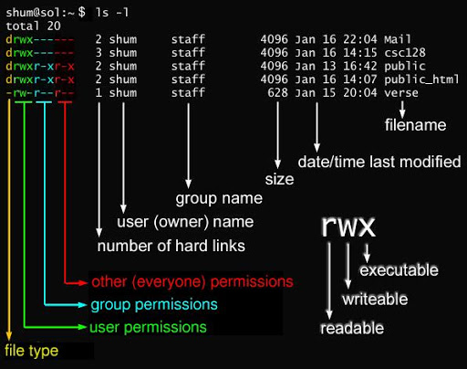

[[toc]]

## 引言

在在我们平时生活中，操作系统用的最多的是Windows系统，那么对于 Linux 文件系统结构可能看起来特别陌生。在Windows系统下，系统的整个磁盘会被拆分为不同的磁盘分区，而且每个磁盘会分配一个不同的盘符，比如 C:\、D:\ 等等，每个磁盘分区都单独存放自己的文件，它们有自己的根目录，每个磁盘分区的起点就是它们的根目录，比如 C:\、D:\，如果想要找到一个文件，我们只要依次进入该文件所在的磁盘分区即可。

而Linux 操作系统也有目录的概念，只是Linux 和Windows 的磁盘管理有一点区别，Linux 是将整个磁盘进行统一的管理，不存在C:\、D:\ 等盘符，Linux整个系统只有一个根目录 "/"，所有的文件和目录都是在这个根目录下，它表示 Linux 文件系统的起点，因为在Linux系统中一切都是文件，其中的目录、字符设备、光盘、打印机等都被抽象成了文件，所以平时和我们打交道的都是文件。

## Linux 目录结构

Linux 系统上的所有内容都位于 / 目录下。

> 注意一下，在Linux 中目录之间的间隔使用的是正斜线 （forward slash）"/"，而 Windows中用的是反斜线 （back slash）"\\"。


### 各目录含义

* /：根目录，文件的最顶端，是整个 Linux 文件系统的起点，它是最重要的，因为所有其他目录都是从它派生的，它负责启动、修复和恢复 Linux 系统。
* /bin：bin是Binary的缩写, 代表二进制文件，包含可执行程序，这些程序用于引导或修复的最小功能。它通常包含 cp（copy）、rm（remove）、ls 等 shell 命令，并且任何用户都有权限执行。它还包含引导脚本可能依赖的程序。Bin 文件夹也可以在文件系统树的其他部分找到。
* **/boot**： 此目录包含负责启动 Linux 机器的所有可执行文件或程序，包括一些连接文件以及镜像文件，其中Linux 的内核就存放在这个目录中。
* /dev ： dev是Device(设备)的缩写, 存放的是Linux的外部设备，例如：硬盘、光驱、鼠标等设备文件，在Linux中访问设备的方式和访问文件的方式是相同的。
* **/etc**： 这个目录非常重要，用于存放系统和程序所需的配置文件，作用类似于 Windows 的注册表。
* **/home**：普通用户的主目录，在Linux中，每个用户都有一个自己的目录，一般该目录名是以用户的账号命名的，比如 user1 的home目录是 /home/user1。
* /lib, /lib32, /lib64：这些是存储库的目录。库是应用程序用于执行各种功能的文件，这些文件是 /bin 目录中的二进制文件所必需的。其作用类似于Windows里的DLL文件。它们自己不能被执行，需要被其他的程序调用，几乎所有的应用程序都需要用到共享库。
* /media：用于挂载设备，linux系统会自动识别一些设备，例如U盘、光驱等等，当识别后，linux会把识别的设备挂载到这个目录下。
* /mnt：系统提供该目录是为了让用户临时挂载别的文件系统的，我们可以将光驱挂载在/mnt/上，然后进入该目录就可以查看光驱里的内容了，例如增加一块硬盘，需要手动挂载。
* **/opt**：该文件夹通常包含来自任何第三方供应商的手动安装的软件，默认是空的。比如你安装一个Mysql数据库则就可以放到这个目录下。
* /proc：这个目录是一个虚拟的目录，该目录包含包含有关系统进程和资源的信息的所有伪文件。每个进程都有一个目录（以进程 ID 命名），其中包含有关该进程的所有必要信息，这些信息不会保存在硬盘驱动器上。它是系统内存的映射，我们可以通过直接访问这个目录来获取系统信息。
* /root：该目录为系统管理员，也就是超级权限者root用户的home目录。
* /run：用于存放进程产生的临时文件。它是一个 tempfs 文件系统，这意味着当系统重新启动或关闭时，其中的所有内容都会被删除。它用于存储进程用于早期工作的运行时信息
* /srv：这称为服务目录，其中保存了来自服务的数据。对您来说，它很可能为 null，但如果您运行 Web 服务器或 FTP 服务器，您将在此处存储其他用户将访问的文件。由于它是驱动器的根目录，因此它提供更好的保护。
* /sys：该目录下安装了内核中新出现的一个文件系统 sysfs，该文件系统是内核设备树的一个直观反映。此目录类似于 /run 目录，因为它不会以物理方式写入光盘。它是在每次机器启动时生成的，因此您不会在此处保存任何内容，也不会在此处挂载任何内容。
* /tmp：用来存放一些临时文件的，所有用户都可执行写操作。
* **/usr**：与系统和系统管理员用于执行维护的 /bin 目录相反，这是用户应用程序空间，用户使用的程序将在其中安装。此处安装的任何程序都被认为是基本系统服务的非必要程序，很多的应用程序和文件都默认放在这个目录下，类似于Windows下的Program Files目录。
* /usr/bin： 这是系统用户使用的应用程序和命令的存放目录。大多数用户日常使用的命令（如 ls、cp、gcc、python 等）都位于此目录中。
* /usr/sbin： 这代表系统管理员可以使用的系统二进制文件，标准用户在未经许可的情况下无权访问。
* /usr/src： 这是系统内核源代码和部分软件源代码的存放目录。通常用于存储与系统核心功能相关的源代码。
* **/usr/local** ：这是用户手动安装的软件和应用程序的存放目录。通常用于存放系统包管理器（如 apt、yum）未管理的软件。，也相当于在Windows下的Program Files这个目录。
* **/var**：这个目录中存放着在不断扩充着的东西，它包含预计大小会随着时间的推移而增长的文件和目录，例如动态数据。/var/log 包含系统和应用程序日志文件，这些文件的大小会随着您使用系统而增加。我们习惯将那些经常被修改的目录放在这个目录下。
* /lost+found：这个目录一般情况下是空的。当系统非法关机后，这里就存放了一些文件， 是系统在文件系统修复时存放已恢复的损坏或孤立文件的目录。

> /boot,/etc,/home,/opt,/user,/user/local,/var可以多了解一些。

## Linux常用终端命令

### 光标移动

* Ctrl + A：将光标移动到行首。
* Ctrl + E：将光标移动到行尾。
* Alt + F：向前移动一个单词。
* Alt + B：向后移动一个单词。
* Ctrl + F：向前移动一个字符。
* Ctrl + B：向后移动一个字符。

### 文本编辑

* Ctrl + U：删除光标前的所有内容（从光标位置到行首）。
* Ctrl + K：删除光标后的所有内容（从光标位置到行尾）。
* Ctrl + W：删除光标前的一个单词。
* Ctrl + D：删除光标后的一个字符（如果没有内容则退出终端）。
* Ctrl + T：交换光标前的两个字符。
* Alt + T：交换光标前的两个单词。
* Alt + U：将光标后的单词转换为大写。
* Alt + L：将光标后的单词转换为小写。
* Alt + C：将光标后的单词首字母大写。

### 历史命令

* Ctrl + P：显示上一条命令（等同于上箭头）。
* Ctrl + N：显示下一条命令（等同于下箭头）。
* Ctrl + R：搜索历史命令（输入关键字后按回车执行）。
* Ctrl + G：退出历史命令搜索模式。

### 进程控制

* Ctrl + C：终止当前进程。
* Ctrl + Z：暂停当前进程，放入后台。
* Ctrl + L：清屏。
* Ctrl + S：暂停终端输出（屏幕冻结）。
* Ctrl + Q：恢复终端输出（解除屏幕冻结）。

### 其他

* Ctrl + D：退出当前终端会话或发送EOF（文件结束符）。
* Ctrl + X + E：使用默认文本编辑器编辑当前命令（通常是nano或vim）。
* Tab：自动补全命令或文件名。
* Alt + .：插入上一条命令的最后一个参数。

### 终端管理

* Ctrl + Shift + C：复制选中的文本。
* Ctrl + Shift + V：粘贴文本。
* Ctrl + Shift + T：新建标签页（在支持标签页的终端中）。
* Ctrl + Shift + W：关闭当前标签页。
* Ctrl + Page Up/Page Down：切换标签页。

## Linux 文件权限和属性

### 基本概念

Linux 中的每个文件和目录都有权限设置，这些权限决定了哪些用户可以对文件执行哪些操作。权限分为三类：

**读（Readable, `r`）**：允许查看文件内容或列出目录中的文件。
**写（Writable, `w`）**：允许修改文件内容或在目录中创建、删除文件。
**执行（Executable, `x`）**：允许运行文件（如果是可执行文件）或进入目录。

权限针对三类用户分配：

**属主（Owner）**：文件的所有者，通常是创建文件的用户。
**属组（Group）**：文件所属的用户组，组内的用户共享相同的权限。
**其他用户（Other）**：既不是文件所有者，也不在文件所属组中的其他用户。

### 查看文件权限

使用 `ls -l` 命令可以查看文件或目录的详细信息，包括权限、所有者、所属组、文件大小和修改时间等。例如：

```bash
$ ls -l
-rw-r--r-- 1 user group 4096 Jan 26 10:00 example.txt
drwxr-xr-x 2 user group 4096 Jan 26 10:01 mydir
```

这些权限字符串可以分为四部分：
文件类型：

* -：普通文件。
* d：目录。
* l：符号链接。
* b: 装置文件里面的可供储存的接口设备。
* c: 装置文件里面的串行端口设备，例如键盘、鼠标。
* 属主权限：第 2-4 位，表示文件所有者的权限。
* 属组权限：第 5-7 位，表示文件所属组的权限。
* 其他用户权限：第 8-10 位，表示其他用户的权限。



我们对这两行示例字符串进行解析，可以得到以下信息：

-rw-r--r--：

* 文件类型：-（普通文件）。
* 属主权限：rw-（可读、可写，不可执行）。
* 属组权限：r--（仅可读）。
* 其他用户权限：r--（仅可读）。

drwxr-xr-x：

* 文件类型：d（目录）。
* 属主权限：rwx（可读、可写、可执行）。
* 属组权限：r-x（可读、可执行，不可写）。
* 其他用户权限：r-x（可读、可执行，不可写）。

其实除了这个符号表示法，也可以通过八进制数字法表示。每一个权限代表一个数字：

* 读（r）：4
* 写（w）：2
* 执行（x）：1

将属主、属组和其他用户的权限分别相加，得到一个三位数的八进制数。例如：

rwxr-xr--：

* 属主：rwx = 4 + 2 + 1 = 7
* 属组：r-x = 4 + 0 + 1 = 5
* 其他用户：r-- = 4 + 0 + 0 = 4
* 最终权限：754也就是文件的读写运行权限赋予文件所有者，把读和运行的权限赋予群组用户，把读的权限赋予其他用户。

### 更改文件权限

我们通常会遇到需要更改文件的属主、属组，或者修改文件的权限的情况。为了进行这些操作，Linux 提供了三个常用的命令：chgrp、chown 和 chmod。它们分别用于更改文件的属组、属主以及文件的读写执行权限。

1. chgrp：更改文件属组

chgrp 命令用于更改文件的属组。文件的属组决定了哪些用户组有权访问该文件。当文件的属主需要将文件从一个组转移到另一个组时，使用该命令非常有用。格式如下：

```bash
chgrp [新属组] [文件]

# 将文件的属组更改为 groupname
chgrp groupname file.txt
```

2. chown：更改文件所有者（owner）及属组

chown 命令用于更改文件的属主和/或属组。它允许你将文件的所有者和所属组更改为指定的用户和组。可以只修改属主、只修改属组，或者同时修改两者。格式如下：

```bash

chown [属主]:[属组] [文件]
示例：
# 将文件的属主更改为 user，属组更改为 group
chown user:group file.txt

# 只修改属主，不修改属组
chown user file.txt

# 只修改属组，不修改属主
chown :group file.txt
```

3. chmod：更改文件权限

chmod 命令用于更改文件的读、写和执行权限。每个文件和目录都有与之相关的权限设置，决定了哪些用户可以读取、修改或执行该文件。chmod 命令通过符号模式或数字模式来设置权限。符号模式更直观，数字模式则用于更精确地定义权限。格式如下：

```bash
chmod [权限] [文件]
示例：
# 使用符号模式给文件添加执行权限
chmod +x file.txt

# 使用数字模式设置文件权限：属主可读写执行，属组可读执行，其他用户只读
chmod 755 file.txt
```

## 参考文献

[https://dev.to/afif_ahmed/everything-you-need-to-know-about-linux-directories-57ha](https://dev.to/afif_ahmed/everything-you-need-to-know-about-linux-directories-57ha)
[https://www.cnblogs.com/tanghaorong/p/14099917.html](https://www.cnblogs.com/tanghaorong/p/14099917.html)
[https://www.howtogeek.com/117435/htg-explains-the-linux-directory-structure-explained/#ndash-the-root-directory](https://www.howtogeek.com/117435/htg-explains-the-linux-directory-structure-explained/#ndash-the-root-directory)
[https://gist.github.com/zhulianhua/befb8f61db8c72b4763d](https://gist.github.com/zhulianhua/befb8f61db8c72b4763d)
[https://www.runoob.com/linux/linux-file-attr-permission.html](https://www.runoob.com/linux/linux-file-attr-permission.html)
