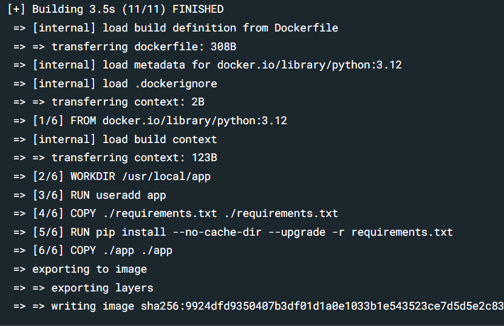

[[toc]]

## 引言

在当今快速迭代的软件开发领域，环境配置差异和服务部署复杂度是开发者面临的两大痛点。传统虚拟机虽然解决了部分环境隔离问题，但其资源占用高、启动速度慢的特性难以适应现代敏捷开发需求。Docker 作为容器化技术的标杆，通过轻量化、秒级启动的特性，实现了开发、测试、生产环境的无缝衔接，成为 DevOps 流程中不可或缺的一环。

## 什么是Docker？

在日常的开发过程中，一个经常遇到的挑战就是如何确保应用在不同的环境中都能一致地运行。这常常会因为操作系统的差异、依赖库的版本不匹配等问题而变得复杂。想象一下，你在本地开发的应用在测试环境中崩溃，或者一个功能在生产环境中表现得与预期完全不同——这就是所谓的“在我的机器上能运行”现象。

Docker就是为了解决这些问题而生的。它是一种基于Linux容器技术的开源平台。Linux容器利用操作系统的内核特性，如命名空间和控制组，提供了应用程序运行环境的隔离。Docker把应用程序和其运行环境打包到一个称为“容器”的独立实体中。容器包含了所有运行所需的代码、运行时、系统工具、系统库等，它可以运行在任何支持Docker的操作系统上，消除了环境差异带来的麻烦。

## Docker 的优势

Docker带来的优势是显而易见的。首先，它提供了**环境一致性。无论是开发者本地环境、测试服务器，还是生产环境，Docker容器确保了应用的行为一致。这样，开发者可以专注于代码而不是环境配置。其次，Docker容器比传统的虚拟机更轻量**，因为它们共享主机的操作系统内核，从而启动更快，占用更少的系统资源，这意味着更高的资源利用率和更低的成本。

此外，Docker的**可移植性非常出色。你可以在一个地方构建镜像，然后在任何支持Docker的地方运行这个镜像，不需要担心系统版本或依赖问题。Docker还支持版本控制**，这意味着你可以像管理代码一样管理应用的不同版本，轻松地进行回滚或测试新的版本。

通过简化复杂的环境管理，Docker大幅度地减少了开发和运维团队之间的摩擦，使得“开发即生产”（DevOps）的理念得以更轻松地实现。总的来说，Docker不仅解决了日常开发中常见的环境一致性问题，还通过容器化技术给软件开发和部署带来了革命性的变化。

## Docker 的基本使用

### Docker 基础知识

在开始使用Docker之前，了解一些核心概念是必不可少的。Docker的生态系统由几个关键概念组成：

* Image（镜像）：Docker镜像是一个轻量、独立的软件包，包含了运行应用程序所需的所有环境和代码。镜像就像一个类似的“快照”或“模板”，你可以从中启动多个容器实例。镜像构建时，Docker使用分层存储技术，每个层代表一次文件系统的修改，这种分层设计使得镜像的高效共享和分发成为可能。

* Registry（注册表）：这是Docker镜像的托管和分发平台。最著名的公共注册表是Docker Hub，你可以在这里搜索、拉取（pull）现有的镜像，或推送（push）你创建的镜像到公共或私有注册表。私有注册表可以保证镜像的安全性和专有性。

* Compose（Docker Compose）：当你的应用需要多个容器协同工作时，Docker Compose就派上了用场。它允许你使用一个YAML文件定义所有服务、网络、卷等配置，这样你就可以用一个命令启动和管理整个应用栈。Compose简化了多容器应用的开发和部署过程。

### 构建镜像

构建镜像的过程是将你的应用封装进一个可独立运行的环境中：

#### 镜像层（Image Layers）

Docker利用分层文件系统来构造镜像。每个Dockerfile指令会创建一个新的层，这些层是只读的，并且叠加在一起形成最终的镜像。如果你在Dockerfile中修改了一行代码，Docker只会重新构建和存储这一层的变化，其他未变化的层继续使用缓存。

#### 书写DockerFIle

Dockerfile：这是构建镜像的脚本文件。Dockerfile中的每一行都是一条构建指令，如：

* FROM：指定基础镜像。
* RUN：执行命令，例如安装软件包。
* COPY：将文件从构建上下文复制到镜像文件系统中。
* WORKDIR：设置工作目录。
* EXPOSE：声明容器将要监听的端口。
* CMD：指定容器启动时默认执行的命令。
* ENV：设置正在运行的容器将使用的环境变量
* USER: 设置容器运行时使用的用户。

```Dockerfile
//这是最简单的Dockerfile的书写
FROM node:20-alpine
WORKDIR /app
COPY . .
RUN yarn install --production
CMD ["node", "./src/index.js"]
```

当我们有了自己的项目后需要书写Dockerfile时，可以遵循以下几步：

1. 先创建` Dockerfile `文件，与package.json同级。
2. 确定基础映像，也就是使用 FROM 指令
3. 复制文件到镜像中，使用 COPY 指令
4. 安装依赖，使用 RUN 指令
5. 运行应用，使用 CMD 指令

#### build

当我们写好Dockerfile后，就可以使用docker build命令来构建镜像了。

```bash
docker build .
```

我们会看到打包的progress信息，如下所示：



此时，我们可以使用` docker images `来查看本地的镜像。

#### 构建缓存

Docker在构建过程中会利用缓存来加速。如果Dockerfile中的指令没有变化，Docker会跳过重新构建该层，直接使用缓存层。如果我们不希望使用缓存，最简单的方法就是改动` Dockerfile `或者改变` package.json `文件。

### 运行容器

构建好容器镜像后，下一步就是运行该容器。我们使用` docker images `查看本地的镜像，并选择想要运行的镜像。

```bash
docker run [OPTIONS] IMAGE [COMMAND] [ARG...]  //这个是详细命令，可以进行相关配置

docker images // 我们这里直接找到容器id运行即可
docker run [imageId]
```

运行容器后，管理这些容器的生命周期也是关键的部分。你可以使用` docker ps `命令来查看当前正在运行的容器。如果你想查看所有的容器，包括已停止的，可以加上-a参数。` docker ps `不仅会展示容器的名称和ID，还会显示它们的状态、使用的端口映射等重要信息。

当需要停止容器时，可以使用` docker stop `命令来优雅地停止它们，然后你可以用` docker start `重新启动它们。如果某个容器不再需要，你可以用` docker rm `来删除它。不过，删除之前确保容器已经停止；如果需要删除正在运行的容器，可以加上-f参数来强制删除。

要进入一个正在运行的容器中进行调试或手动操作，可以使用` docker exec `命令，这允许你执行容器内的命令。例如，` docker exec -it my-node-app sh `会让你进入到容器的shell中。

查看容器的日志可以通过` docker logs `命令来实现，这对于诊断问题非常有用。同时，` docker stats `命令让你可以监控容器的资源使用情况，如CPU和内存的占用。

当你的镜像更新或者应用配置改变时，你需要停止旧容器，删除它，然后用更新后的镜像重新运行你的应用。这是一个常见的更新实践。记住，Docker容器设计是短暂的，意味着它们可以被快速创建、启动、停止和删除。除非你使用了卷或其他持久化存储方法(使用卷映射或者绑定挂载)，容器内数据是非持久的。

## Docker 常用指令

Docker提供了一套丰富的命令行工具，用于管理容器、镜像、网络、卷以及整个Docker生态系统的生命周期。以下是这些指令的详细说明：

### 生命周期管理

Docker容器的生命周期包括创建、启动、停止、删除等操作：

* **docker run**：用于创建并启动一个新的容器。例如，`docker run -it ubuntu /bin/bash`会启动一个Ubuntu容器并进入其bash。
* **docker start**：启动一个已停止的容器。
* **docker stop**：优雅地停止一个运行中的容器。
* **docker restart**：重启一个容器。
* **docker pause**：暂停容器中的所有进程。
* **docker unpause**：恢复已暂停容器的进程。
* **docker kill**：立即终止容器中的所有进程。
* **docker rm**：删除一个或多个容器。
* **docker wait**：阻塞直到容器停止，然后输出它的退出码。

### 容器操作

对容器的日常操作包括：

* **docker ps**：列出所有运行中的容器，`docker ps -a`列出所有容器，包括停止的。
* **docker exec**：在运行的容器中执行命令。例如，`docker exec -it <容器ID> /bin/bash`进入容器的bash终端。
* **docker logs**：查看容器的日志输出。
* **docker stats**：实时展示容器的资源使用情况。
* **docker inspect**：返回一个或多个Docker对象的详细信息。
* **docker attach**：连接到一个运行中的容器。
* **docker commit**：从容器创建一个新的镜像。

### 镜像仓库

管理镜像及与Docker注册表（如Docker Hub）的交互：

* **docker pull**：从注册表拉取镜像。
* **docker push**：推送镜像到注册表。
* **docker search**：在Docker Hub中搜索镜像。
* **docker login**：登录到Docker注册表。
* **docker logout**：登出Docker注册表。

### 本地镜像管理

本地镜像的管理：

* **docker images**：列出本地存在的镜像。
* **docker rmi**：删除一个或多个镜像。
* **docker build**：根据Dockerfile构建镜像。
* **docker tag**：为镜像添加一个新的标签。
* **docker save**：将镜像保存为tar文件。
* **docker load**：从tar文件加载镜像。

### Docker Compose

Docker Compose用于定义和运行多容器Docker应用：

* **docker-compose up**：启动定义在`docker-compose.yml`中的所有服务。
* **docker-compose down**：停止并移除Compose项目中的容器、网络、卷等。
* **docker-compose ps**：列出项目中的所有容器。
* **docker-compose logs**：查看项目中容器的日志。
* **docker-compose exec**：在服务的容器中执行命令。
* **docker-compose build**：构建或重建服务。

### 网络管理

管理Docker网络：

* **docker network create**：创建一个新的网络。
* **docker network ls**：列出所有网络。
* **docker network inspect**：查看网络的详细信息。
* **docker network connect**：将容器连接到网络。
* **docker network disconnect**：从网络中断开容器。
* **docker network rm**：删除一个或多个网络。

### 卷命令

管理Docker卷：

* **docker volume create**：创建一个新卷。
* **docker volume ls**：列出所有卷。
* **docker volume inspect**：查看卷的详细信息。
* **docker volume rm**：删除一个或多个卷。
* **docker volume prune**：删除所有未使用的卷。

Docker提供了丰富的命令行工具来管理容器、镜像、网络和存储等资源。常用的Docker命令包括docker run, docker ps, docker images, docker exec, docker logs, docker pull, docker push, 和 docker-compose up等。这些命令涵盖了容器的创建、启动、停止、删除，镜像的管理及与注册表的交互，网络和卷的配置。对于这些命令的详细参数使用，可以参考其他在线资源(如[菜鸟编程](https://www.runoob.com/docker/docker-command-manual.html))

## Docker 高级功能与应用

### Docker Swarm 和 Kubernetes：容器编排

在实际的生产环境中，管理成千上万个容器变得极为复杂。这时候，容器编排工具就显得尤为重要。Docker Swarm和Kubernetes（K8s）分别为容器管理提供了不同的解决方案。

Docker Swarm是Docker自家的编排工具，它让你可以将多个Docker主机连接成一个集群，从而简化了服务的管理。通过Docker Swarm，用户可以轻松地初始化集群，并且实现服务的自动扩展和负载均衡。如果某个节点发生故障，Swarm能够自动迁移容器到健康的节点上，确保服务的高可用性。

相比之下，Kubernetes作为目前容器编排的领军者，提供了更加丰富的功能和灵活性。K8s不仅可以自动管理容器的部署和扩展，还能通过kubectl工具进行容器和服务的管理。Docker Desktop也为开发者提供了一个本地的K8s环境，便于开发和测试。Kubernetes强大的自动调度和负载均衡能力，使得它在大规模的容器集群中尤其适用。

### Docker网络与服务发现

Docker提供了多种网络模式，使得容器能够在隔离环境中与其他容器或外部系统进行高效、安全的通信。常见的网络模式包括桥接网络、主机网络和覆盖网络。桥接网络适用于容器之间的本地通信，主机网络则是容器与宿主机共享网络命名空间，适合高性能要求的场景。而覆盖网络则适合在多个主机间进行容器通信，尤其是在Docker Swarm或Kubernetes集群中，容器之间的跨主机通信就需要依赖覆盖网络。

Docker还内建了DNS服务，使得容器之间的服务发现变得更加简单。容器可以通过服务名直接进行通信，无需知道具体的IP地址，极大地简化了网络配置和管理。

### Docker 和 CI/CD（持续集成与持续部署）

在现代的软件开发过程中，持续集成与持续部署（CI/CD）是提升效率的关键。Docker在这一过程中发挥了重要作用，尤其是在保证跨环境一致性方面。通过使用Docker容器，开发者可以在本地、测试、生产等不同环境中运行相同的镜像，避免了“在我的机器上能运行”的问题。

Docker容器的隔离性使得每个CI/CD任务都能在独立的环境中运行，确保不同任务之间不会互相影响。通过结合Docker Compose或Kubernetes，开发者还可以自动化部署流程，将应用从代码提交到生产环境的过程完全自动化，大大提高了开发效率。

### Docker资源限制与调优

虽然Docker容器在提供隔离性和高效性方面表现优异，但在生产环境中，容器的资源管理至关重要。Docker允许开发者对容器进行资源限制，以确保系统资源的合理分配。你可以通过限制容器的CPU和内存使用来防止某个容器占用过多资源，从而影响其他容器的运行。

此外，Docker还支持对容器的I/O性能进行调优，确保每个容器能够公平地访问磁盘和网络资源。这样，无论是单一容器还是多个容器共存的环境，资源都能被合理分配，保障整体性能。

### Docker 和微服务架构

随着微服务架构的广泛应用，Docker成为了构建和管理微服务的理想选择。每个微服务都可以运行在独立的容器中，这样不仅可以避免服务间的相互依赖冲突，还能提高应用的可扩展性。

Docker容器提供的环境隔离性，使得每个微服务可以独立开发、测试和部署，支持快速迭代。同时，容器化应用能够根据流量需求进行灵活扩展，满足业务增长的需要。容器编排工具（如Docker Swarm或Kubernetes）更能进一步简化多服务的管理。

### Docker 在无服务器计算中的应用

随着无服务器计算的兴起，Docker也找到了新的应用场景。在无服务器架构中，容器可以作为函数即服务（FaaS）的执行环境。每次事件触发时，Docker容器会按需启动并运行对应的任务，而计算资源则按实际的调用次数进行计费。

Docker在事件驱动计算中也发挥着重要作用。当有外部事件（例如文件上传、HTTP请求等）发生时，Docker容器可以自动启动并执行相关的任务。这种按需启动的方式，不仅提高了资源利用率，还帮助开发者简化了基础设施的管理。

### 日志与监控

在容器化的应用中，日志管理与监控是保证系统稳定运行的必要手段。Docker为容器提供了内建的日志功能，可以通过docker logs命令查看容器的标准输出和错误信息。对于实时监控，docker stats命令可以展示容器的资源使用情况，包括CPU、内存和网络等。

更进一步，你可以将Docker容器与Prometheus、Grafana等监控工具集成，实时收集和展示容器的各项指标，帮助开发和运维团队提前发现潜在问题，确保应用的高可用性和高性能。

## 参考文献

[https://docs.docker.com/get-started/introduction/](https://docs.docker.com/get-started/introduction/)
[https://www.runoob.com/docker/docker-command-manual.html](https://www.runoob.com/docker/docker-command-manual.html)
[https://www.ruanyifeng.com/blog/2018/02/docker-tutorial.html](https://www.ruanyifeng.com/blog/2018/02/docker-tutorial.html)
