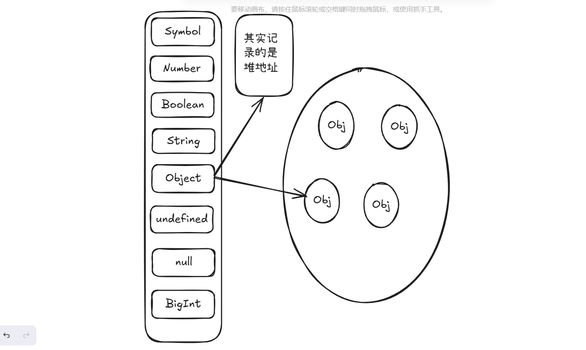

[[toc]]

## 引言

React Hooks是React库中引入的一项重大功能，旨在解决类组件中的状态逻辑复用问题，并提供一种更直接操控React的功能。Hooks允许你在函数组件中使用state和其他React特性，而不需要编写类组件。本文将详细解析几个关键的Hooks，帮助你掌握它们在实际开发中的应用。

## 一、useState

React 是一个用于构建用户界面的框架，在每次组件更新时通常会触发重新渲染。React 的重新渲染机制会重新执行函数式组件中的代码，这意味着组件的局部变量会被重新初始化。因此，如果我们单纯地在组件中定义普通的变量来存储数据，这些变量会随着每次渲染而被重置，并无法保存状态。

为了应对这个问题，React 提供了一组称为 Hooks 的 API，这些 API 允许函数式组件管理状态和副作用，而无需使用类组件。useState 是 React 提供的最基础、最常用的 Hook，它可以让我们在函数式组件中添加状态。

` useState `的作用是声明一个状态变量，该变量会被 React 存储在其内部的内存中，并且不会因组件重新渲染而丢失。同时，useState 提供一个函数用于更新这个状态变量，当状态变量被更新时，React 会自动触发组件的重新渲染以反映 UI 的变化。也就是它接收初始状态并返回一对值：当前状态，以及一个让你更新状态的设置函数。

```jsx
const [index, setIndex] = useState(0);
```

### 简单实现

```jsx
let componentHooks = [];
let currentHookIndex = 0;

// useState 在 React 中是如何工作的（简化版）
function useState(initialState) {
  let pair = componentHooks[currentHookIndex];
  if (pair) {
    // 这不是第一次渲染
    // 所以 state pair 已经存在
    // 将其返回并为下一次 hook 的调用做准备
    currentHookIndex++;
    return pair;
  }

  // 这是我们第一次进行渲染
  // 所以新建一个 state pair 然后存储它
  pair = [initialState, setState];

  function setState(nextState) {
    // 当用户发起 state 的变更，
    // 把新的值放入 pair 中
    pair[0] = nextState;
    updateDOM();//重置hook的下标，重新渲染
  }

  // 存储这个 pair 用于将来的渲染
  // 并且为下一次 hook 的调用做准备
  componentHooks[currentHookIndex] = pair;
  currentHookIndex++;
  return pair;
}
```

useState 的简单实现通过一个外部数组（如 componentHooks）存储组件的状态，与一个索引变量（如 currentHookIndex）配合来定位状态，React 会按顺序匹配它们，从而在组件每次渲染时能够正确复用之前的状态；同时通过一个 setState 函数更新状态并触发重新渲染，保证状态的持久性和 UI 的动态更新。这种机制使得函数式组件可以像类组件一样管理状态。

### 注意点

#### 不可变性原则

首先 state 的工作方式是基于不可变数据原则，我们需要在每次更新时创建一个新的 state 对象，正如我们修改对象时，会创建一个新对象，然后使用拓展运算符先复制一遍，再将需要修改的数据放在最后。如果直接修改state，可能有少部分时候侥幸成功了，但大多数时候会出现问题。

```jsx
import { useState } from 'react';

export default function MovingDot() {
  const [position, setPosition] = useState({
    x: 0,
    y: 0
  });
  return (
    <div
    // 在这里直接修改了state，会导致界面不更新
      onPointerMove={e => {
        position.x = e.clientX;
        position.y = e.clientY;
      }}
      style={{
        position: 'relative',
        width: '100vw',
        height: '100vh',
      }}>
      <div style={{
        position: 'absolute',
        backgroundColor: 'red',
        borderRadius: '50%',
        transform: `translate(${position.x}px, ${position.y}px)`,
        left: -10,
        top: -10,
        width: 20,
        height: 20,
      }} />
    </div>
  );
}
```

上面的代码中因为直接修改了state的x、y，因为没有使用 state 的设置函数，React 并不知道对象已更改。所以 React 没有做出任何响应，也就不会更新界面。

```jsx
//这样修正将正确的更新界面。
// error
onPointerMove={e => {
  position.x = e.clientX;
  position.y = e.clientY;
}}
// right
onPointerMove={e => {
  setPosition({
    x: e.clientX,
    y: e.clientY
  });
}}
```

上面这个只更新x和y，对象结构很浅，如果我们遇到了一个对象中有多个数据，但是我们只需要更改其中一项时，那么就用了 `...`，先进行复制，再对需要更改的数据覆盖。

```jsx
// 数据可能是这样的：
const [person, setPerson] = useState({
    firstName: 'Barbara',
    lastName: 'Hepworth',
    email: 'bhepworth@sculpture.com',
    phone:'123456789',
    address:'西安市'
  });

// 我们需要更改其email
handleEmailChange(){
  setPerson({
    ...person,
    email: '123456788@qq.com'
  })
}
```

关于数组方面的话，最常用的就是` map `、` filter `、` reduce `、` slice `,像` push `、` sort `、` reverse `等会修改原始数组的则不可直接使用。但最需要注意的就是数组中有对象这种复杂数据类型，它们并不是**真的**位于数组“内部”。可能他们在代码中看起来像是在数组“内部”，但其实数组中的每个对象都是这个数组“指向”的一个存储于其它位置的值。这里就涉及到了内存的栈和堆了。因此在面临这种情况时，需要将该对象重新赋值给一个新的对象，然后再修改这个对象中特定的数据。



#### 避免在分支条件中调用hook

如我们上面的简单代码示例，在 React 中，hook 的调用顺序是固定的，这意味着在函数组件中，hook 的调用顺序是固定的，并且不能在分支条件中调用 hook。如果将 useState 调用放入条件分支，可能会导致渲染过程中的状态混乱或错误，这会发生我们不可预料的错误。

#### 批量更新

```jsx
<button onClick={() => {
  setNumber(number + 5);
  setNumber(n => n + 1);
  setNumber(42);// 42 最后会覆盖前面的值
}}>
```

在 React 中，当在函数组件中调用多个 setState 时，React 会将这些 setState 封装为一个批量更新，并在一个单独的更新中更新组件的状态。这意味着，在单个更新中，setState 的调用顺序并不重要，因为 React 会将它们合并为一个更新。所以，上面的代码示例最后的num应该是42。

#### 避免不必要的状态

在 React 中，我们需要尽量避免不必要的状态，因为这会增加组件的复杂度，并且可能会导致不必要的渲染。最常见的情况就是部分状态可以通过其他状态计算得到。

```jsx
const [firstName,setFirstName] = useState('');
const [lastName,setLastName] = useState('');
const [fullName,setFullName] = useState('');
//fullName完全可以通过firstName和lastName计算得到，所以可以省略fullName,优化为下面这样。
const [firstName,setFirstName] = useState('');
const [lastName,setLastName] = useState('');
const fullName = `${firstName} ${lastName}`;
```

## 二、useContext

在 React 应用中，状态共享是非常常见的需求。例如，当父组件中的某个状态需要被很多子组件（甚至是深层子组件）实时访问时，如果我们通过 props 一层层地传递会显得非常繁琐且难以维护，这种现象被称为**“props drilling”**（属性传递地狱）。

React 为了解决这个问题，提供了一个全局状态管理工具——Context API，而函数式组件中通过 useContext 来简化 Context 的使用。

### 创建Context

```jsx
// themeContext.js
import { createContext } from 'react';

const ThemeContext = React.createContext('light');
// main.js
function App() {
  // 定义一个共享的状态
  const [theme, setTheme] = React.useState('dark');

  return (
    <ThemeContext.Provider value={theme}>
      <Toolbar />
    </ThemeContext.Provider>
  );
}
// toobar.js
import { useContext } from 'react';
function Toolbar() {
  return (
    <div>
      <ThemedButton />
    </div>
  );
}

function ThemedButton() {
  // 使用 useContext 订阅 Context
  const theme = React.useContext(ThemeContext);

  return <button style={{ background: theme === 'dark' ? '#000' : '#fff' }}>Click Me</button>;
}
```

### 使用场景

从上面的代码示例中，我们可以看出，可以避免“props drilling”（属性层层传递）。但它的滥用可能导致状态管理混乱，因此我们应该根据具体情况选择最优的解决方案。
在使用 context 之前，你可以考虑以下几种替代方案：

* 优先从 props 开始。当状态只需在少量层级间传递时，直接使用 props 是最简单且清晰的方式。这种方法虽然在嵌套组件较深时可能显得冗余，但它可以明确地展示数据流向，维护起来也较为直观。如果数据层级较深且需要传递的数据较多，则需要考虑优化。
* 利用 children 和抽象组件减少传递层级。当中间组件只是状态的“过路者”时，可以将需要渲染的内容通过 children 传递给父组件，让父组件负责状态传递，子组件专注于呈现，这样可以显著减少中间组件的干扰，增强代码的可读性。
* 最后选择使用 Context API 共享跨层级状态。

useContext 更适用于下面的场景：

* 主题： 如果你的应用允许用户更改其外观（例如暗夜模式），你可以在应用顶层放一个 context provider，并在需要调整其外观的组件中使用该 context。
* 当前账户： 许多组件可能需要知道当前登录的用户信息。将它放到 context 中可以方便地在树中的任何位置读取它。某些应用还允许你同时操作多个账户（例如，以不同用户的身份发表评论）。在这些情况下，将 UI 的一部分包裹到具有不同账户数据的 provider 中会很方便。
* 路由： 大多数路由解决方案在其内部使用 context 来保存当前路由。这就是每个链接“知道”它是否处于活动状态的方式。如果你创建自己的路由库，你可能也会这么做。
* 状态管理： 随着你的应用的增长，最终在靠近应用顶部的位置可能会有很多 state。许多遥远的下层组件可能想要修改它们。通常 将 reducer 与 context 搭配使用来管理复杂的状态并将其传递给深层的组件来避免过多的麻烦。

## 三、useReducer

在 React 中，useState 是管理组件内状态的首选，当状态较为简单时，它足够高效且易用。而 useContext 则适用于共享跨组件层级的全局状态。但是，当状态逻辑变得复杂，比如需要执行多种操作或管理嵌套数据结构时，单纯依赖 useState 或 useContext 可能难以维护，代码也会变得冗长。这时，useReducer 提供了一种更清晰、更结构化的方式来处理复杂的状态管理。

useReducer 是 React 提供的一个用于管理复杂状态的 Hook，是“Reducer 模式”的实现。这种模式将状态的更新逻辑集中到一个函数中，使得状态管理更加清晰。当一个组件需要根据不同的动作更新状态，或者需要组合多个状态变化逻辑时，useReducer 能够很好地应对这些需求。此外，它与 useContext 可以结合使用，以实现模块化的全局状态管理。

### 使用Reducer整合

useReducer 通过一种类似于 Redux 的“Reducer 模式”来集中管理状态更新逻辑。它不仅让代码结构更清晰，还能帮助我们在复杂的状态变化场景下更好地组织代码。通常，useReducer 的使用包括以下几个基本步骤：

* 定义初始状态。
* 创建一个 reducer 函数，集中处理状态更新逻辑。
* 使用 useReducer Hook 将状态和状态更新逻辑结合起来，这个钩子接受两个参数：reducer 函数和初始状态，返回一个数组，数组的第一个元素是状态，第二个元素是dispatch函数。

```jsx
import React, { useReducer } from 'react';
// 定义初始状态
const initialState = { count: 0 };

// 定义 reducer 函数
function reducer(state, action) {
  // 可以使用if...else，也可以使用switch，视情况而定
  switch (action.type) {
    case 'increment':
      return { count: state.count + 1 };
    case 'decrement':
      return { count: state.count - 1 };
    case 'reset':
      return { count: 0 };
    default:
      throw new Error('Unhandled action type');
  }
}

// 计数器组件
export default function Counter() {
  const [state, dispatch] = useReducer(reducer, initialState);

  return (
    <div>
      <h1>Count: {state.count}</h1>
      <button onClick={() => dispatch({ type: 'increment' })}>Increase</button>
      <button onClick={() => dispatch({ type: 'decrement' })}>Decrease</button>
      <button onClick={() => dispatch({ type: 'reset' })}>Reset</button>
    </div>
  );
}
```

下面是不使用useReducer的版本

```jsx
import React, { useState } from 'react';

// 计数器组件
export default function Counter() {
  const [count, setCount] = useState(0);

  // 事件处理函数
  const handleIncrement = () => {
    setCount((prevCount) => prevCount + 1);
  };

  const handleDecrement = () => {
    setCount((prevCount) => prevCount - 1);
  };

  const handleReset = () => {
    setCount(0);
  };

  return (
    <div>
      <h1>Count: {count}</h1>
      <button onClick={handleIncrement}>Increase</button>
      <button onClick={handleDecrement}>Decrease</button>
      <button onClick={handleReset}>Reset</button>
    </div>
  );
}
```

虽然只使用useState的这个版本看着代码更少，这是由于目前的事件处理函数和状态更新逻辑简单，当我们需要面临包含着复杂的数据和逻辑时，使用useReducer会更清晰。并不是所有人都喜欢用 reducer，没关系，这是个人偏好问题。你可以随时在 useState 和 useReducer 之间切换，它们能做的事情是一样的！

### 合格的 reducer

纯函数与不可变性是 Reducer 的根基。在每次状态更新时，必须通过创建新对象来实现，避免直接修改原状态。通过使用展开运算符 {...state} 或数组的 map() 等不可变操作，既能满足 React 依赖状态引用变化来触发渲染的机制，也能避免因副作用导致的意外问题。例如，在 Reducer 中混入异步请求或直接操作 DOM，就如同在心脏搭桥手术时突然掏出手机刷视频，整个系统会因此失去可控性。因此，Reducer 的职责是足够单纯的，专注于输入与输出之间的确定性关系。

Action 设计应像瑞士军刀般精准，每个 action 只负责处理单一的逻辑。比如 ADD_TODO 只用来添加条目，而 TOGGLE_TODO 单纯切换完成状态。若某个 action 同时负责数据请求和状态修改，就像有人用显微镜拧螺丝一样，完全没有用对工具。为了简化管理并降低出错概率，可以将 action.type 作为常量集中管理。例如 export const ADD = 'todo/add'，这一方式不仅清晰明了，还能避免扩展时硬编码字符串可能带来的维护隐患。

初始状态是程序的起跑线，它定义了整个状态的基础结构和起点。明确地设计 initialState = { list: [], loading: false } 不仅有助于理清状态数据的形状，还能为状态重置提供可靠的锚点。当需要清空数据或恢复初始状态时，直接 return initialState 要比逐个字段手动赋值直观得多，这就像格式化硬盘比逐个删除文件更加彻底高效。清晰的初始状态能帮助团队保持对状态流转的理解一致性。

为了增强代码的健壮性，防御性编程不可或缺。在 switch 的 default 分支中添加 throw new Error('未知 action 类型') 的逻辑，相当于为代码安装了烟雾报警器。错误抛出的好处在于，它能快速暴露拼写错误或用错 action 的情况。比如一个经典案例中，一个团队因拼错 action.type（将 FETCH_DATA 写成了 FETCH_DATE），最终排查了三天才发现问题。这类问题通过严格的错误处理机制能够在早期阶段被快速定位，省去了许多无谓的时间成本。此外，使用 TypeScript 为 action 和状态定义类型结构（如 type Action = AddAction | DeleteAction）也非常重要，它能够在编译阶段拦截大量的类型错误，防止问题在运行时才暴露出来。

可维护性往往藏在代码细节里。开发阶段可以通过 console.log('[Reducer] 旧状态:', state, '新状态:', newState) 为状态流的变化记录“可视化轨迹”，这就像给系统装上行车记录仪。当 Reducer 涉及复杂逻辑时，不妨将某些功能操作比如 updateUserProfile 抽离为独立的工具函数，这种做法不仅减少了重复代码，还能提升代码的可读性，就像将杂乱的电线整理成标准的模块化布线。

最终，一个优秀的 Reducer 就像一块精密的机械表。每个齿轮（action）都精准运转、相互咬合，发条（纯函数）稳定提供动力，同时又有完善的防护装置（错误处理）来确保意外情况不会扩散。这种设计方式既保证了系统的可靠性，又能让状态管理在项目复杂度不断增长的情况下，依然保持良好的迭代能力与可控性。这不仅是开发者追求平稳、高效项目的保障，也赋予系统持续进化的灵活性。

### 将 reducer 和 context 结合

Reducer 可以整合组件的状态更新逻辑。Context 可以将信息深入传递给其他组件。我们可以组合使用它们来共同管理一个复杂页面的状态。

```jsx
//TasksContext.js -> 创建对应的 context
import { createContext } from 'react';

export const TasksContext = createContext(null);
export const TasksDispatchContext = createContext(null);

// main.js -> 在根组件中创建 context

import { TasksContext, TasksDispatchContext } from './TasksContext.js';

export default function TaskApp() {
  const [tasks, dispatch] = useReducer(tasksReducer, initialTasks);
  // ...
  return (
    <TasksContext.Provider value={tasks}>
      <TasksDispatchContext.Provider value={dispatch}>
        ...
      </TasksDispatchContext.Provider>
    </TasksContext.Provider>
  );
}

// 如果想要使用就在对应的组件函数中 useContext(TasksContext)

 const tasks = useContext(TasksContext);
 const dispatch = useContext(TasksDispatchContext);
```

## 四、useRef

当你希望组件“记住”某些信息，但又不想让这些信息 触发新的渲染 时，useRef 是一个非常合适的工具。作为 React 中一个非常强大的 Hook，useRef 的主要作用是跨组件的渲染周期保存不可变的值，或者直接访问和操作 DOM 元素。简而言之，它是一个万能的“小工具箱”，在很多情况下能优雅地解决一些看似棘手的问题。

与状态管理工具（如 useState）不同的是，useRef 操作的值发生变化时不会导致组件的重新渲染。这种特性使其在处理需要跨渲染周期保存但不影响 UI 更新的值时非常高效，同时也能避免性能上的不必要开销。从存储定时器 ID、保存旧状态到直接操纵 DOM，useRef 囊括了许多场景下的实用功能，是开发者管理组件内部逻辑的得力助手。

如果你看过 react 官网的这个秒表的示例代码，你就能明白这个示例中 useRef 的作用。

```jsx
import { useState, useRef } from 'react';

export default function Stopwatch() {
  const [startTime, setStartTime] = useState(null);
  const [now, setNow] = useState(null);
  const intervalRef = useRef(null);

  function handleStart() {
    setStartTime(Date.now());
    setNow(Date.now());

    clearInterval(intervalRef.current);
    intervalRef.current = setInterval(() => {
      setNow(Date.now());
    }, 10);
  }

  function handleStop() {
    clearInterval(intervalRef.current);
  }

  let secondsPassed = 0;
  if (startTime != null && now != null) {
    secondsPassed = (now - startTime) / 1000;
  }

  return (
    <>
      <h1>时间过去了： {secondsPassed.toFixed(3)}</h1>
      <button onClick={handleStart}>
        开始
      </button>
      <button onClick={handleStop}>
        停止
      </button>
    </>
  );
}

```

在这个示例中，我们使用了 useRef 来保存 intervalRef，并在组件卸载时清除它。这样，即使组件被重新渲染，intervalRef 的值也不会被重置，从而避免了在组件重新渲染时 intervalRef 的值被重置。因此，ref 也被称为一种 **脱围机制**，它虽然在组件中声明，却不会随着函数重新渲染而重置。

### 简单实现 useRef

```jsx
// React 内部
function useRef(initialValue) {
  const [ref, unused] = useState({ current: initialValue });
  return ref; //我们通过ref.current 获取值
}
```

### useRef 使用场景

* 存储 timeout ID
* 存储和操作 DOM 元素(最常见)
* 存储不需要被用来计算 JSX 的其他对象。

但是在使用 useRef 时，也会可能发生一些其他事情，例如将过多的权限暴露给组件，从而导致组件的不稳定性。

```jsx
import { useRef } from 'react';

function MyInput({ ref }) {
  return <input ref={ref} />;
}

export default function MyForm() {
  const inputRef = useRef(null);

  function handleClick() {
    inputRef.current.focus();
  }

  return (
    <>
      <MyInput ref={inputRef} />
      <button onClick={handleClick}>
        聚焦输入框
      </button>
    </>
  );
}
```

这是一个用来聚焦输入框的组件。在组件中，我们使用 useRef 来创建一个 ref，并将其传递给 MyInput 组件。在 MyInput 组件中，我们使用 ref 属性来将 ref 传递给输入框。MyInput 暴露了原始的 DOM 元素 input。这让父组件可以对其调用focus()。然而，这也让父组件能够做其他事情 —— 例如，改变其 CSS 样式。我们有时候可能会因为某些原因，希望限制一下暴露的功能，类似于 vue 的 defineExpose，React 中同样也提供了方法，使用` useImperativeHandle `

```jsx
import { useRef, useImperativeHandle } from "react";

function MyInput({ ref }) {
  const realInputRef = useRef(null);
  useImperativeHandle(ref, () => ({
    // 只暴露 focus，没有别的
    focus() {
      realInputRef.current.focus();
    },
  }));
  return <input ref={realInputRef} />;
};

export default function Form() {
  const inputRef = useRef(null);

  function handleClick() {
    inputRef.current.focus();
  }

  return (
    <>
      <MyInput ref={inputRef} />
      <button onClick={handleClick}>聚焦输入框</button>
    </>
  );
}
```

但是我们也需要注意，组件 dom 在渲染完成后才可以获取，我们不应该在渲染完成前去读取ref.current.

## 五、useMemo 和 useCallback

在 React 中，useMemo 和 useCallback 是两个相似但用途略有不同的 Hook，它们的主要目的是优化性能，避免因组件的重复渲染或数据更新导致的一些不必要的性能问题。

它们通过记忆（memoization）的方式，缓存某些计算结果或函数引用，使 React 的工作流更高效，尤其是在组件复杂、计算量大的场景中非常实用。

### useMemo

useMemo 是一个用于计算复杂结果的 Hook，它会根据依赖值来决定是否需要重新计算。如果依赖没有变化，useMemo 会直接返回缓存中的值，从而避免重复的开销。

```JSX
const cachedValue = useMemo(calculateValue, dependencies)
```

calculateValue：要缓存计算值的函数。它应该是一个没有任何参数的纯函数，并且可以返回任意类型。React 将会在首次渲染时调用该函数；在之后的渲染中，如果 dependencies 没有发生变化，React 将直接返回相同值。否则，将会再次调用 calculateValue 并返回最新结果，然后缓存该结果以便下次重复使用。

dependencies：所有在 calculateValue 函数中使用的响应式变量组成的数组。响应式变量包括 props、state 和所有你直接在组件中定义的变量和函数。如果你在代码检查工具中 配置了 React，它将会确保每一个响应式数据都被正确地定义为依赖项。依赖项数组的长度必须是固定的并且必须写成 [dep1, dep2, dep3] 这种形式。React 使用 Object.is 将每个依赖项与其之前的值进行比较。

### useMemo使用场景

* 跳过代价昂贵的重新计算
* 跳过组件的重新渲染
* 防止过于频繁地触发 Effect
* 记忆另一个 Hook 的依赖
* 记忆一个函数

默认情况下，React 会在每次重新渲染时重新运行整个组件。如果计算速度很快，数据计算量小的话，这不是什么问题。但是如果正在过滤一个大型数组或者进行一些费时的计算，并且数据并未发生变化，那么我们肯定希望可以跳过这个计算的过程，那么就可以使用useMemo。并且官方也给了我们一个标准的参考值，如果某一过程的计算时间超过**1ms**，那么记忆此计算结果是有意义的。

当父组件向子组件传递对象或数组类型的 props 时，若未使用 useMemo，每次父组件渲染都会创建新引用，导致子组件无效重渲染。通过缓存对象/数组引用，可避免这一性能损耗。

当 useEffect 依赖某个派生计算结果时，若该结果未缓存，父组件任何状态变化都会触发重新计算，进而触发 Effect。通过 useMemo 稳定计算结果，可精准控制 Effect 执行时机。同理，当自定义 Hook 的依赖项是复杂对象或动态生成的值时，使用 useMemo 也可避免因依赖项引用变化导致 Hook 内部逻辑重复执行。

```JSX
// 防止频繁触发effect
const formattedData = useMemo(() => format(rawData), [rawData]);

useEffect(() => {
  // 仅当 formattedData 变化时触发
  sendToAnalytics(formattedData);
}, [formattedData]);

// 防止hook内部逻辑重复执行
const userPermissions = useMemo(() => 
  calculatePermissions(currentUser, roles), 
  [currentUser, roles]
);

useCustomHook(userPermissions); // 仅权限变化时触发 Hook 逻辑
```

### useCallback

useCallback 是一个允许你在多次渲染中缓存函数的 React Hook。

```JSX
const cachedFn = useCallback(fn, dependencies)
```

fn：想要缓存的函数。此函数可以接受任何参数并且返回任何值。在初次渲染时，React 将把函数返回给你（而不是调用它！）。当进行下一次渲染时，如果 dependencies 相比于上一次渲染时没有改变，那么 React 将会返回相同的函数。否则，React 将返回在最新一次渲染中传入的函数，并且将其缓存以便之后使用。React 不会调用此函数，而是返回此函数。你可以自己决定何时调用以及是否调用。

dependencies：有关是否更新 fn 的所有响应式值的一个列表。响应式值包括 props、state，和所有在你组件内部直接声明的变量和函数。如果你的代码检查工具 配置了 React，那么它将校验每一个正确指定为依赖的响应式值。依赖列表必须具有确切数量的项，并且必须像 [dep1, dep2, dep3] 这样编写。React 使用 Object.is 比较每一个依赖和它的之前的值。

>值得注意的是:如果你忘记使用依赖数组，useCallback 每一次都将返回一个新的函数

### useCallback使用场景

* 跳过组件的重新渲染
* 从记忆化回调中更新 state
* 防止频繁触发 Effect
* 优化自定义 Hook

### useMemo 和 useCallback 区别

useMemo 缓存函数调用的结果。在这里，它缓存了调用 computeRequirements(product) 的结果。除非 product 发生改变，否则它将不会发生变化。这让你向下传递 requirements 时而无需不必要地重新渲染 ShippingForm。必要时，React 将会调用传入的函数重新计算结果。

useCallback 缓存函数本身。不像 useMemo，它不会调用你传入的函数。相反，它缓存此函数。从而除非 productId 或 referrer 发生改变，handleSubmit 自己将不会发生改变。这让你向下传递 handleSubmit 函数而无需不必要地重新渲染 ShippingForm。直至用户提交表单，你的代码都将不会运行。

## 六、useEffect

useEffect 作为 React 函数组件的副作用管理工具，其核心在于建立组件状态与外部系统的动态连接。这种连接遵循声明式编程范式——开发者通过依赖数组声明副作用与状态的关联关系，React 则自动追踪状态变化并触发相应的清理与重建逻辑。与类组件生命周期方法不同，useEffect 不再强调“挂载”“更新”等时序概念，而是将副作用抽象为与数据变化绑定的同步过程。这种设计使得组件逻辑更贴近数据流本质，尤其在处理 WebSocket 连接、DOM 事件订阅等需要精确控制资源分配的场景中展现出更强的可维护性。

### 执行规则与依赖管理

useEffect 的执行由两个核心参数控制：setup 函数和依赖数组。当组件完成 DOM 更新后，React 会比较当前依赖项与前次渲染的依赖项。若存在变化（使用 Object.is 进行严格比较），则先执行前次 Effect 的清理函数，再运行新的 setup 函数。依赖数组的三种形态决定了不同的行为模式：

空数组 [] 表示 Effect 仅在组件挂载时执行一次，常用于初始化第三方库或一次性事件绑定。非空数组如 [dep1, dep2] 使 Effect 在指定依赖变化时重新运行，适用于数据拉取、参数同步等场景。省略依赖数组会导致每次渲染后都触发 Effect，这种模式需谨慎使用以避免性能问题。值得注意的是，React 18 严格模式在开发环境下会故意双重调用 setup/cleanup 函数，用以暴露未正确实现清理逻辑的缺陷，这在生产环境中不会发生。

### useEffect 使用场景

* 数据获取场景中，Effect 需处理竞态条件和内存泄漏风险。通过 ignore 标志与清理函数的配合，可确保异步请求按预期工作：当组件卸载或依赖变化时，陈旧的请求结果会被自动忽略。这种模式尤其适用于搜索建议、分页加载等高频交互场景。但要注意，若将获取的数据直接设置为状态且未正确声明依赖，会形成“获取数据→状态更新→触发 Effect→再次获取数据”的死循环。

* 事件监听场景要求精确的绑定与解绑时机。将 addEventListener 和 removeEventListener 配对使用可避免内存泄漏，但需注意若事件处理函数依赖组件状态，应使用 useCallback 包裹函数以保证引用稳定。对于 resize、scroll 等高频事件，可以结合防抖/节流技术优化性能。

* 动画控制场景需要协调 React 渲染周期与浏览器渲染管线。使用 useLayoutEffect 可在浏览器绘制前执行 DOM 操作，避免视觉闪烁。对于第三方动画库，清理函数中必须调用实例销毁方法，防止残留的定时器或缓存对象导致异常。

* 表单联动校验场景展示了 Effect 在状态派生中的应用。当多个表单项存在复杂校验关系时，Effect 可自动触发校验逻辑更新。但需注意，若校验涉及大量计算，应结合 useMemo 对结果进行缓存，避免重复计算消耗性能。

* 在 Effect 中根据先前的的 state 更新 state

```JSX
  function Counter() {
  const [count, setCount] = useState(0);

  useEffect(() => {
    const intervalId = setInterval(() => {
      setCount(count + 1); // 你想要每秒递增该计数器...
    }, 1000)
    return () => clearInterval(intervalId);
  }, [count]); // 🚩 ... 但是指定 `count` 作为依赖项总是重置间隔定时器。
  // ...
}
// 这样更改为“更新函数”将解决问题
  useEffect(() => {
    const intervalId = setInterval(() => {
      setCount(c => c + 1); // ✅ 传递一个 state 更新器
    }, 1000);
    return () => clearInterval(intervalId);
  }, []); // ✅现在 count 不是一个依赖项
  
```

### 性能优化方向

Effect 的优化核心在于减少不必要的执行次数。对于依赖项中的对象或数组，使用 useMemo 缓存可避免因引用变化触发的无效更新。函数类型的依赖项应通过 useCallback 固定引用，特别是当子组件使用 React.memo 优化时，函数引用的稳定性直接决定子组件是否会重渲染。

高频更新的场景（如实时绘图、游戏循环）需要特殊处理。将状态更新逻辑移出 Effect，改用 useRef 保存可变值，结合 requestAnimationFrame 进行批量更新，可显著降低渲染压力。对于必须使用 Effect 的情况，通过依赖项的空数组和 ref.current 的配合，可实现“只执行一次”的监听模式。

### 思维方式转变

从生命周期到 Effect 的转变，实质是从“时间驱动”到“数据驱动”的范式迁移。开发者应培养“效应思维”——不再关注组件处于挂载还是更新阶段，而是聚焦于状态与副作用的依赖关系。这种思维模式下，每个 Effect 都是独立的数据同步单元，通过声明依赖关系构建出清晰的副作用图谱。当面对复杂交互逻辑时，可将其分解为多个原子化的 Effect，通过组合实现强大功能，同时保持代码的可维护性。

## 总结

React Hooks 的引入彻底改变了开发者编写 React 组件的方式，使得函数组件能够具备类组件的所有能力，同时保持了代码的简洁性和可复用性。通过 Hooks，开发者可以更灵活地管理组件的状态、副作用以及逻辑复用，而无需依赖类组件的复杂生命周期方法。当然还有一些其他的hooks，在之后的文章介绍。

## 参考文献

[https://zh-hans.react.dev/learn/adding-interactivity](https://zh-hans.react.dev/learn/adding-interactivity)
