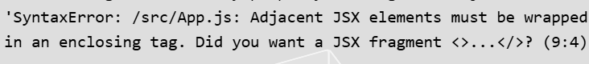

[[toc]]

## 引言

在现代前端开发中，React已经成为最受欢迎的框架之一，而React的强大之处离不开JSX的支持。作为一种JavaScript语法扩展，JSX通过将HTML与JavaScript无缝融合，极大地提升了开发体验与代码可读性。

本文将带你全面了解JSX的基本知识、优势与核心功能，帮助你快速上手这一工具。

## JSX是什么？

### JSX定义

JSX 在语法上看起来与 HTML 相近，但它其实是 JavaScript 的语法扩展。React 认为渲染逻辑本质上与其他 UI 逻辑内在耦合，使用 JSX 等于是把标记 (markup) 与逻辑 (logic) 写在一起，因此JSX本质是一种语法糖，可以用来创建 React 元素。

### JSX的基本原理

JSX代码在编译时会被转换成普通的JavaScript对象。JSX的编译就涉及到了我们的老朋友Babel，我们都知道Babel可以用来将ES6代码转换为ES5代码，用来兼容低版本浏览器，在这里可以知道它的一个新的用处，就是将JSX代码转换为JavaScript对象，然后通过React.createElement()方法创建React元素。

example:

  ```javascript
  const element = <h1>Hello, world!</h1>;
  ```

上面的JSX代码会被编译成下面的JavaScript代码：

  ```javascript
  const element = React.createElement("h1", null, "Hello, world!");
  ```

## JSX的语法简介

### 1.只能返回一个根元素

如果想要在一个组件中包含多个元素，需要用一个父标签把它们包裹起来。

```javascript
 return (
    <div className="App">
      <h1>Hello CodeSandbox</h1>
      <h2>Start editing to see some magic happen!</h2>
    </div>
  );
  // 或者
  return (
    <>
    <div className="App">
      <h1>Hello CodeSandbox</h1>
      <h2>Start editing to see some magic happen!</h2>
    </div>
    </>
  );
```

如果不是单个根元素则会报错

  ```javascript
   return (
    <div className="App">
      <h1>Hello CodeSandbox</h1>
      <h2>Start editing to see some magic happen!</h2>
    </div>
    <div>111</div>
  );
  ```



### 2.标签必须闭合

JSX 要求标签必须正确闭合。这里需要说的一个就是像 `` 这样的自闭合标签必须书写成 ``，其他的与HTML标签一样，需要有开始标签和结束标签。

### 3.使用驼峰式命名法给 所有大部分属性命名

JSX 最终会被转换为 JavaScript，而 JavaScript 会对变数名称有限制，像是不能使用保留字和连接号，所以在写 JSX 时，才会将许多属性名称用camelCase 的方式书写。举例来说：如果要加入 css 的 class，会用 className、stroke-width 会改成使用 strokeWidth。但还是有例外，`aria-*` 和 `data-*` 属性的写法，还是与 HTML 中相同写法。

### 4.对JavaScript表达式使用大括号

当你想把一个字符串属性传递给 JSX 时，把它放到单引号或双引号中,但是如果当你需要在JSX代码中包含一个JavaScript表达式时，你需要用大括号{}来包裹它。这可以用于任何事情，从显示动态数据到有条件地渲染组件。

```javascript
export default function Avatar() {
  const avatar = 'https://i.imgur.com/7vQD0fPs.jpg';
  const description = 'Gregorio Y. Zara';
  return (
    
  );
}
```

当然除了字符串、数字和其它 JavaScript 表达式，我们有时候需要传递对象，对象也用大括号表示,对象也用大括号表示,因此，为了能在 JSX 中传递，你必须用另一对额外的大括号包裹对象。

```javascript
<component person = { name: "Hedy Lamarr", inventions: 5 }></component> // 错误

<component person={{ name: "Hedy Lamarr", inventions: 5 }}></component> // 正确
```

## JSX的优势

### 直接优势

* 使用JSX，我们可以直接在代码中编写HTML结构，无需再手动创建和更新DOM元素。这使得组件的代码结构更加直观，易于理解和维护。
* JSX 执行更快，因为它在编译为 JavaScript 代码后进行了优化。
* 它是类型安全的，在编译过程中就能发现错误。

除此以外，现代的许多网站都是高度动态，许多逻辑会决定内容的呈现，这时把内容与逻辑放在一起 ，能确保有任何更动时两者维持同步，以及在重复使用时也方便。与此同时，跟元件没有相关的内容，可以被到另一个元件当中，这样不同元件的改动也可以保持独立，不怕改某个东西而影响了另一个元件。

## JSX的趋势

JSX的趋势是显而易见的，随着TypeScript对TSX的支持和Vue加入JSX的阵营，将JavaScript逻辑、HTML视图和CSS样式整合到一起的开发方式越来越受到青睐，标志着前端开发向一体化和高效化的方向发展。

## 参考文献

[https://www.explainthis.io/zh-hans/swe/what-is-jsx](https://www.explainthis.io/zh-hans/swe/what-is-jsx)
[https://zh-hans.react.dev/learn/writing-markup-with-jsx](https://zh-hans.react.dev/learn/writing-markup-with-jsx)
